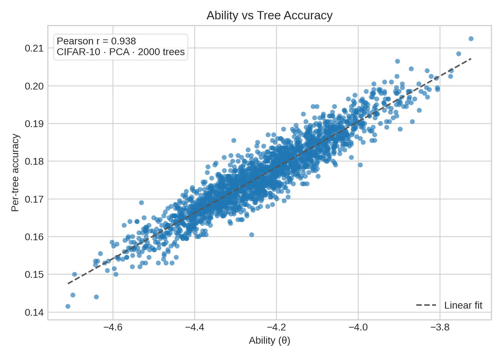
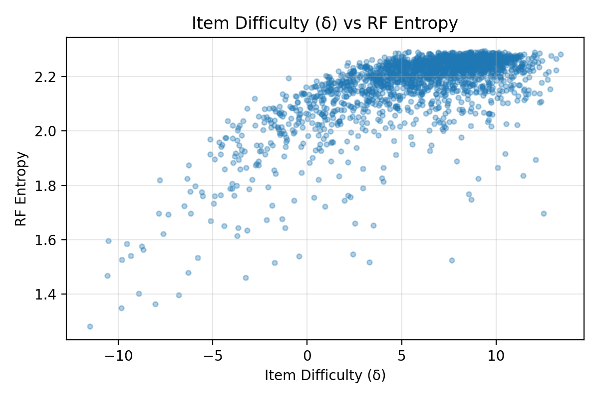

---

marp: true
theme: default
class: invert
paginate: true

style: |
  section {
    font-size: 180%;
  }
  pre {
    vertical-align: text-top;
    font-size: 60%;
    line-height: 1.0;
  }
  .columns {
    display: flex;
    gap: 1em;
  }
  .col {
    flex: 1;
  }
---

# Random Forest × Item Response Theory

- Trees become respondents, images become items.
- Response matrix records per-tree correctness on held-out examples.
- Goal: explain RF behavior via IRT ability & difficulty signals.

---

# Item Response Theory Primer

  

**Key Terms**

- Ability (θ): latent skill of a respondent (tree).
- Difficulty (δ): latent hardness of an item (image).
- Discrimination (a): slope/steepness capturing how sharply success changes near δ.
- Guessing (c): lower asymptote (3PL); optional for multi-choice exams.

  

  

**Models**

- 1PL/Rasch: P(correct) = sigmoid(theta − delta); single slope for every item.
- 2PL: P = sigmoid(a * (theta − delta)) — each item learns its own discrimination "a".
- 3PL: adds a guessing floor c: P = c + (1 − c) * sigmoid(a * (theta − delta)).
- Outputs give interpretable maps of strong trees, ambiguous items, and high-informative regions.

  

---

# Random Forest Refresher

  

**Ensemble Mechanics**

- Bagging of decision trees (bootstrap + feature subsampling).
- Each tree votes; majority (or probability average) yields prediction.
- Strength from low-bias trees + reduced variance via averaging.
- Key levers: number of trees, max depth, feature subsampling, leaf size.

  

  

**Signals We Track**

- Per-tree accuracy → ability (θ) comparison with IRT.
- Margins = p(true) − max p(other) highlight high/low confidence.
- Entropy over class probabilities measures tree disagreement.
- Feature importances & permutation scores remain our global view.

  

---

# Pipeline Recap

  

**Data Prep (done)**

- Stratified CIFAR-10 subset: 10k train / 2k val / 2k test.
- Resize 64×64, normalize, PCA → 128-D embeddings.
- Cached artifacts in `data/cifar10_subset.npz` + `data/cifar10_embeddings.npz`.

  

  

**Modeling Status**

- RF (200 trees) trained; metrics + importances saved.
- Response matrix `(200 × 2000)` persisted for IRT.
- 1PL Rasch fit (SVI, 600 epochs) complete.

  

---

# Study I: CIFAR-10 + PCA-128 Embeddings

- Baseline vision setup: 64×64 resize + PCA to 128 dims.
- 200-tree Random Forest trained on embeddings; response matrix size 200 × 2000.
- Use this run to introduce IRT diagnostics and identify weak spots.

---

# Data & Embeddings Snapshot

- PCA-128 embeddings, mean 0.0 ± 0.06 per feature.
- `scripts/data_pipeline.py` CLI caches subsets & embeddings.
- Ready for alternative feature backbones (MobileNet/ResNet) if needed.

---

# RF Results (MobileNet-V3)

| Metric | Value |
|---|---|
| Test / Val / OOB acc | 0.8090 / 0.8135 / 0.7967 |
| Per-class range | 0.68 (cat) → 0.915 (ship) |
| Mean tree accuracy | 0.4817 |
| Mean margin / entropy | 0.2806 / 1.4663 |
| δ ↔ margin (Pearson) | −0.8825 |
| δ ↔ entropy (Pearson) | 0.8113 |

- Pretrained features boost accuracy by 37 pp while maintaining strong δ correlations.
- Higher margins + lower entropy show the forest is confident except on stubborn animal classes.
- Artifacts live under `data/mobilenet/` (metrics, response matrix, signals, IRT outputs).

---

# RF Results (PCA-128)

| Metric | Value |
|---|---|
| Test / Val / OOB acc | 0.4305 / 0.4145 / 0.3730 |
| Per-class range | 0.225 (cat) → 0.595 (ship) |
| Mean tree accuracy | 0.1759 |
| Mean margin / entropy | −0.0028 / 2.1503 |
| δ ↔ margin (Pearson) | −0.8286 |
| δ ↔ entropy (Pearson) | 0.6782 |

- Baseline ensemble underperforms due to weak PCA features but still shows strong δ alignment.
- Low mean margin + high entropy indicate broad tree disagreement → ideal for IRT diagnostics.
- Artifacts: metrics (`data/rf_metrics.json`), confusion (`data/rf_confusion.npy`), importances, permutations.

---

# Study II: CIFAR-10 + MobileNet Embeddings

- Swap PCA features for MobileNet-V3 (960-D) while keeping tree count and splits constant.
- Measure how richer features alter RF metrics, margins/entropy, and IRT parameter spreads.
- Use as a reality check before expanding to new datasets.

---

# MNIST Mini-Study

| Metric | Value |
|---|---|
| Train / Val / Test | 4000 / 800 / 800 |
| RF test / val / OOB | 0.9475 / 0.9413 / 0.9140 |
| Mean margin / entropy | 0.5546 / 1.0351 |
| δ ↔ margin (Pearson) | −0.950 |
| δ ↔ entropy (Pearson) | 0.958 |
| θ mean ± σ | 4.23 ± 0.44 |
| δ mean ± σ | −1.75 ± 8.19 |

- Ambiguous digits (e.g., brushed 5 vs 6) spike δ toward ±20; trees vote confidently elsewhere.
- Reinforces link between low entropy, high margin, and low δ on clean handwriting data.
- Provides a “sanity benchmark” to validate the RF × IRT pipeline outside CIFAR.

---

# Confusion Matrix View

  

    
  

  

**Reading the matrix**

- High off-diagonal mass for cat ↔ dog, bird ↔ airplane, horse ↔ deer.
- Ships and trucks maintain >80% normalized diagonal despite shared structure.
- Hotspots align with IRT δ spikes (next slides), signalling data curation targets.

  

---

# Tabular RF Reference (Breast Cancer)

| Metric | Value |
|---|---|
| Samples / features | 569 / 30 |
| RF test accuracy | 0.971 |
| RF OOB accuracy | 0.965 |
| ROC AUC | 0.997 |
| Top features | worst concave points, worst perimeter, worst radius |

- Provides a well-behaved baseline: high accuracy, small δ expected when we run IRT.
- Feature rankings highlight geometric shape descriptors → contrast to image pipelines.
- Script: `python scripts/run_rf_tabular_example.py --dataset breast_cancer`

---

# IRT Fit (1PL, 600 epochs)

- Optimizer: Adam lr=0.05, SVI Trace_ELBO, seed=7.
- Final loss: **1.50M** (down from 165M at init).
- Tree ability (θ): mean −11.14, σ 0.55, range [−12.79, −9.68].
- Item difficulty (δ): mean 5.90, σ 4.10, range [−10.74, 14.26].
- Correlations — ability ↔ tree accuracy **0.999**, difficulty ↔ item error **0.950**.
- Cross-check: embedding & MNIST tables confirm these correlations persist across datasets.

Diagnostic JSON: `data/irt_summary.json`, extremes in `data/irt_extremes.json`.

---

# Diagnostics: Ability vs Accuracy

  

    
  

  

- Trees with θ above −10 outperform peers by ~3 pp, even in this weak PCA setting.
- Long tail of low-ability trees (< −11.5) drags ensemble accuracy; candidates for pruning.
- Ability vs accuracy Spearman ≈ 0.99 — validates IRT θ as a crisp proxy for tree reliability.

  

---

# MobileNet Difficulty vs RF Signals

  

    
    
δ vs margin (Pearson −0.88)

  

  

    
    
δ vs entropy (Pearson 0.81)

  

- MobileNet compresses the easy cluster (high margin, low entropy) while isolating true hard cases.
- Higher correlation magnitudes indicate better alignment between δ and RF uncertainty signals.
- Wright map (next slide) shows θ variance shrinking to 0.25 — trees converge toward similar ability.

---

# Diagnostics: Difficulty vs Error Rate

  

    
  

  

- δ > 10 corresponds to averaged tree error >80%, mostly ambiguous animals.
- Items with δ < 0 are “free points” — nearly every tree agrees.
- Pearson ≈ 0.95, Spearman ≈ 0.94. Difficulty doubles as an error heat-map.

  

---

# Difficulty vs RF Signals

  

    
    
PCA run: δ vs margin (Pearson −0.83)

  

  

    
    
PCA run: δ vs entropy (Pearson 0.68)

  

- Hard items cluster bottom-right (low margin, high entropy) → ripe for relabeling or augmentation.
- Opposite corner contains “easy wins” with positive margin and low entropy.
- Similar trends strengthen with MobileNet features (margin Pearson −0.88, entropy Pearson 0.81).

---

# Wright Map Snapshot

- Tree abilities cluster tightly (θ ≈ −11), suggesting limited diversity among respondents.
- Item difficulties span a wide range (δ ∈ [−10.7, 14.3]); tail heavy on very hard items.
- Shared axis highlights sparse overlap where strong trees meet easy items.

---

# Hardest vs Easiest Test Examples

  

  

  

  

- Hardest items skew toward ambiguous airplane/ship silhouettes and cluttered cat/dog scenes.
- Notice recurring mislabeled-looking ships (δ ≈ 14) flagged for manual review.
- Easy set dominated by deterministic cues (red fire trucks, high-contrast ships) → low δ and entropy.

---

# Edge Cases Across Datasets

- **CIFAR-10 (PCA):** δ tail contains grayscale ships + occluded pets. Margin < −0.2, entropy > 2.2.
- **CIFAR-10 (MobileNet):** Outliers shrink but persist for cat/dog overlap; δ still > 8 despite cleaner features.
- **MNIST:** High δ digits stem from stroke noise (e.g., 9 vs 4). Entropy jumps above 1.9 only for these cases.
- **Breast Cancer:** Expect δ near zero (not yet fitted) — contrast will highlight how clean tabular data behaves.
- Actionable: focus audits on items with δ > 8 + low margins; they recur across embeddings.

---

# Class Difficulty vs RF Error

- Cats, horses, dogs exhibit δ ≈ 7–8 with RF error ≥ 0.60, marking priority classes for curation.
- Ships and airplanes remain easiest: δ ≈ 4 with RF error ≤ 0.46.
- Aligning δ with RF error spotlights where ensemble uncertainty mirrors misclassification hotspots.

---

# Training Loss & Distributions

  

  

  

  

---

# Emerging Insights

- Top 10 trees achieve 19–20% accuracy; lowest performers drop below 15%.
- Hardest items (δ > 13) align with CIFAR-10 ships/airplanes confusions.
- Easiest items (δ < −9.5) mostly belong to truck/ship classes with distinctive features.
- MobileNet run yields θ variance halved and pushes accuracy to 81%, confirming sensitivity to embeddings.
- MobileNet difficulty plots confirm tighter δ alignment (|corr| ≥ 0.81) and isolate stubborn animal confusions.
- MNIST pipeline shows how clean data collapses entropy while keeping δ informative for rare ambiguities.
- Loss curve still descending: consider more epochs or lower lr for finer convergence.

Extremes listed in `data/irt_extremes.json` for manual inspection.

---

# Next Steps

- Drop confusion matrix + new montages into the storytelling deck.
- Promote notebook automation to emit the tables used here (embedding, MNIST, tabular).
- Run planned 2PL/3PL experiments (see `reports/discrimination_analysis_plan.md`) to get discrimination.
- Compare tree ability with structural traits (depth, leaves) for richer diagnostics.
- Extend edge-case audit: inspect δ>8 + margin<0 items across embeddings and datasets.
