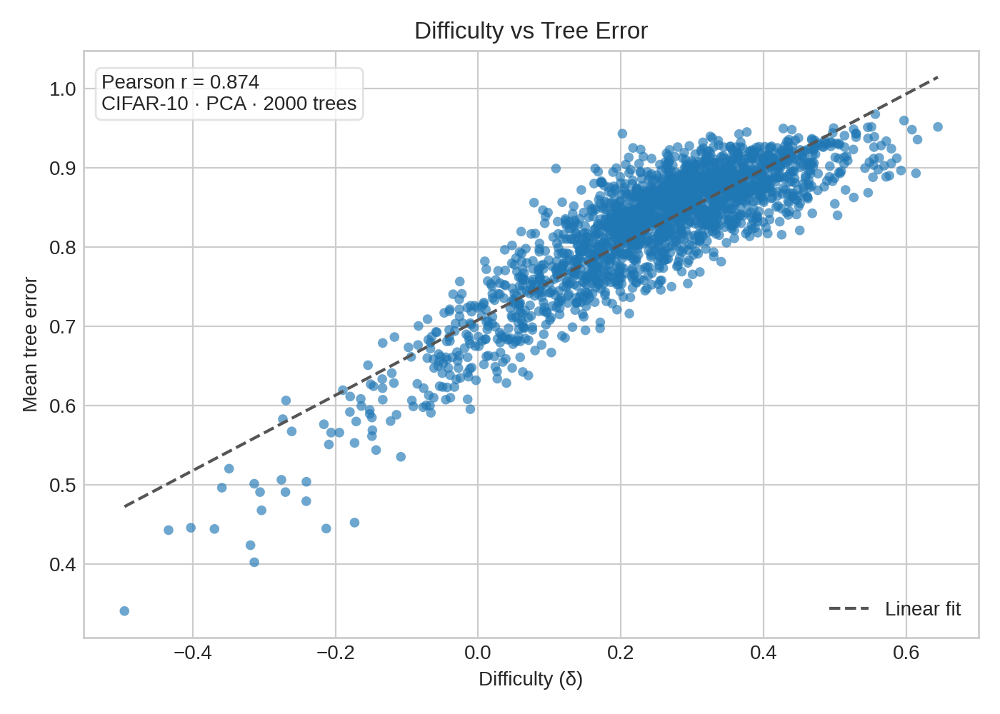
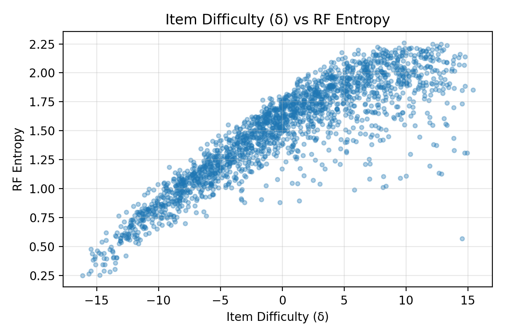
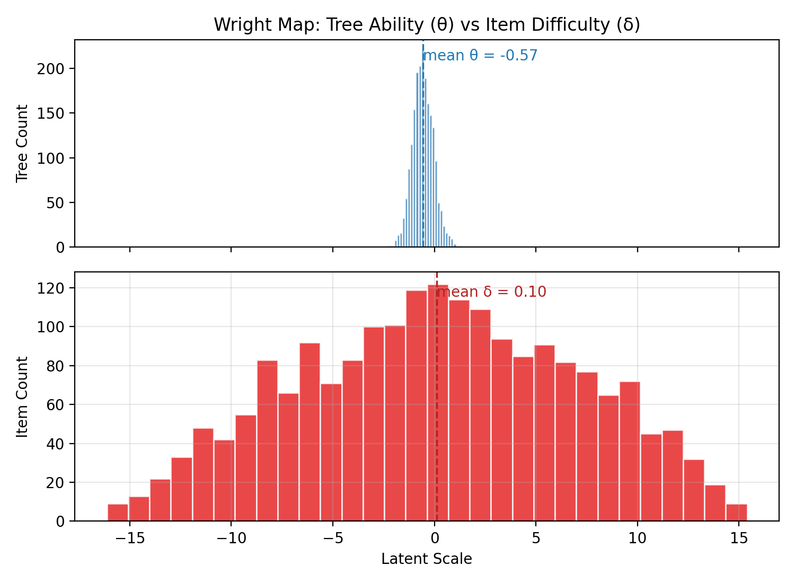
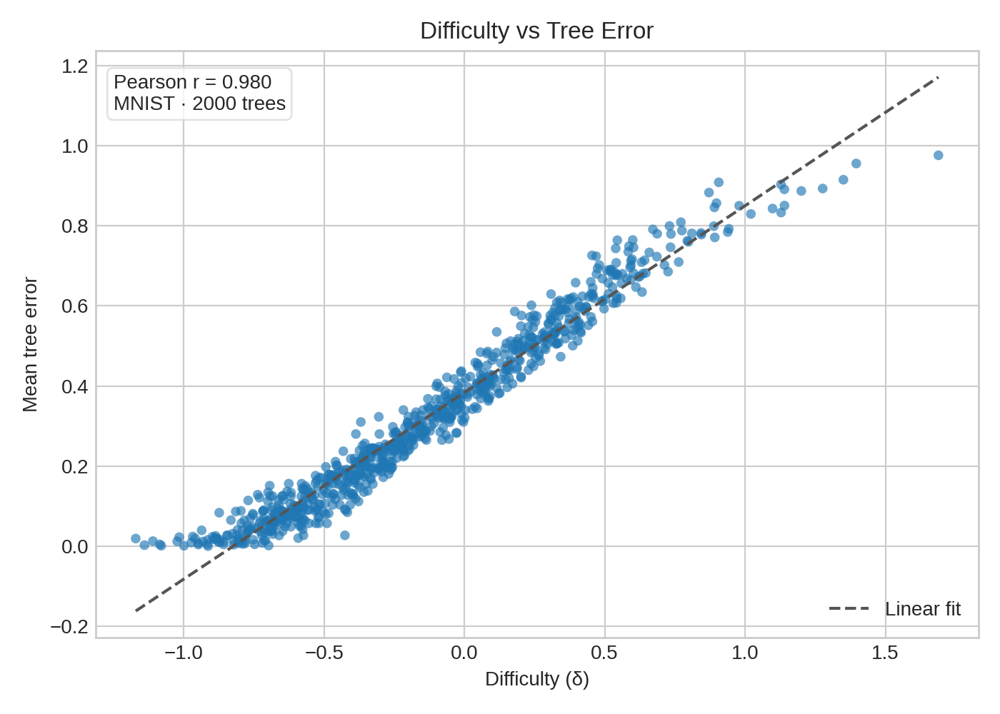
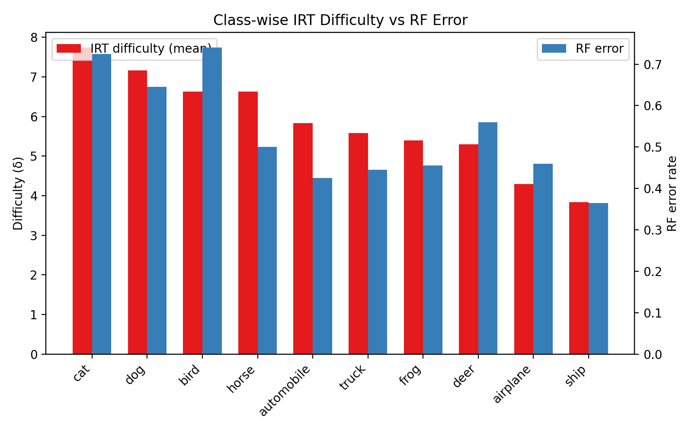

---

marp: true
theme: default
class: invert
paginate: true
math: katex
style: |
  section {
    font-size: 150%;
  }
  pre {
    vertical-align: text-top;
    font-size: 60%;
    line-height: 1.0;
  }
  .columns {
    display: flex;
    gap: 1em;
  }
  .col {
    flex: 1;
  }
footer: Andrew T. Scott &copy; 2025, UTA VLM Lab, Fall 2025
---

# IRTForests

### Random Forest × Item Response Theory Diagnostics

Andrew T. Scott · Fall 2025

<a href="https://github.com/ascott02/IRTForests">github.com/ascott02/IRTForests</a>

---

# Random Forest × Item Response Theory

- Trees become respondents, images become items.
- Response matrix records per-tree correctness on held-out examples.
- Goal: explain RF behavior via IRT ability & difficulty signals.

---

# GenAI In the Loop Scientific Exploration

- Started from a focused README spec outlining goals, datasets, and diagnostics.
- Automated notebook + CLI runs to regenerate every experiment end-to-end.
- Promoted the resulting figures and tables into this deck, sharpening the story each loop.

---

# Motivation & Guiding Questions

- Random forests bundle weak learners; IRT recasts each tree as a respondent with latent ability ($\theta$).
- Held-out images become items whose difficulty ($\delta$) emerges from tree wins and losses.
- How do θ and δ steer backbone choices, surface label issues, and focus the next curation loop?

---

# Story Arc

1. **Background:** IRT mechanics + RF diagnostics we rely on.
2. **Pipeline:** Datasets, embeddings, and response matrices powering the studies.
3. **Case Studies:** Baseline CIFAR, MobileNet upgrade, and MNIST control.
4. **Synthesis:** Cross-study comparisons, takeaways, and next steps.

---

# Why Item Response Theory for Random Forests?

- Trees answer the same held-out images, so treat them as “test takers.”
- Latent **ability** ($\theta$) ranks trees; latent **difficulty** ($\delta$) flags ambiguous images.
- Shared scales let us compare studies, backbones, and curation tactics directly.

---

# Item Response Theory Building Blocks

  

**Core Terms**

- Ability ($\theta$): respondent skill; higher → higher success odds.
- Difficulty ($\delta$): item hardness; higher → harder even for strong respondents.
- Discrimination ($a$): slope near $\delta$.
- Guessing ($c$): floor for multiple-choice exams (rare here).

  

  

**Ensemble Analogy**

- Respondents → decision trees on a shared test set.
- Items → images; responses are binary (tree correct?).
- Response matrix $R_{ij} \in \{0,1\}$ feeds variational IRT.
- Outputs: posteriors over $\theta_i$, $\delta_j$, and information curves.

  

---

# Rasch (1PL) Model in One Picture

  

$$\Pr(R_{ij}=1 \mid \theta_i, \delta_j) = \frac{1}{1 + e^{- (\theta_i - \delta_j)}}$$

- Single global slope keeps parameters on a shared logit scale.
- $(\theta - \delta) = 0$ ⇒ 50% success; shifts left/right change odds.
- Fisher information peaks where curves are steepest—prime for spotting uncertainty.
- <a href="https://ascott02.github.io/irt.html">IRT ICC Visualizer</a>

  

  

    
    
1PL logistic curves for items of varying difficulty

  

---

# What We Extract from IRT

- **Ability histograms** flag low-skill trees worth pruning.
- **Difficulty ladders** highlight mislabeled or ambiguous items.
- **Wright maps** overlay $\theta$ and $\delta$ to expose coverage gaps.
- **Information curves** reveal where ensemble confidence is fragile.
- Together they explain *who* struggles and *why* beyond RF metrics.

---

# Margins, Entropy, and Ensemble Confidence

- Tree votes yield class probabilities we mine for uncertainty signals.
- **Margin** $m(x) = P(\hat{y}=y_{true}) - \max_{c \neq y_{true}} P(\hat{y}=c)$ near 0 marks ambiguity; negative marks systematic flips.
- **Entropy** captures ensemble disagreement; combining both with $\delta$ surfaces mislabeled or OOD items and tracks curation gains.

---

# Pipeline Overview

  

**Data Prep (done)**

- Stratified CIFAR-10 subset: 10k / 2k / 2k splits.
- Resize 64×64, normalize, PCA → 128-D embeddings (plus MobileNet-V3 cache).
- MNIST mini: 4k / 800 / 800 digits, normalized 28×28 grayscale.
- Artifacts cached in `data/cifar10_subset.npz`, `data/cifar10_embeddings.npz`, and `data/mnist/mnist_split.npz`.

  

  

**Modeling Status**

- RF (200 trees) trained for every study; metrics and importances saved.
- Response matrices persisted: CIFAR `(200 × 2000)` for PCA & MobileNet, MNIST `(200 × 800)`.
- 1PL Rasch (SVI, 600 epochs) complete for CIFAR; MNIST mirrors the same notebook.

  

---

# Dataset Overview

| Dataset | Train | Val | Test | Feature Pipeline | Notes |
|---|---|---|---|---|---|
| CIFAR-10 subset | 10,000 | 2,000 | 2,000 | 64×64 RGB → PCA-128 / MobileNet-V3 (960-D) | Shared splits across Study I & II |
| MNIST mini | 4,000 | 800 | 800 | 28×28 grayscale → raw pixels (no PCA) | Control for clean handwriting |

- All studies reuse cached artifacts under `data/`.
- CIFAR runs differ only by embeddings; labels and splits stay fixed.
- MNIST mirrors the workflow to confirm signals on cleaner data.

---

# Section I · Baseline Study (CIFAR + PCA)

- Establish the PCA baseline and its uncertainty signals.
- Use IRT to pinpoint weak trees and hard items that motivate stronger features.

---

# Study I: CIFAR-10 + PCA-128 Embeddings

- Baseline vision setup: 64×64 resize + PCA to 128 dims.
- 200-tree Random Forest with a 200 × 2000 response matrix anchors the diagnostics.
- Use this run to surface weak trees and mislabeled items.

---

# Study I Setup: CIFAR-10 + PCA-128

  

    <ul>
  <li>Fixed stratified CIFAR-10 split (10k / 2k / 2k).</li>
  <li>Resize 64×64, normalize, PCA → 128-D embeddings (`data/cifar10_embeddings.npz`).</li>
  <li>Response matrix 200 × 2000 with mean tree accuracy 0.176.</li>
  <li>Artifacts: metrics, margins, entropy, IRT outputs under `data/` and `figures/`.</li>
    </ul>
  

  

    
    
Study I sample grid — stratified CIFAR-10 slices

  

---

# Study I Performance (PCA-128)

<small>

| Metric | Value |
|---|---|
| Test / Val / OOB acc | 0.4305 / 0.4145 / 0.3730 |
| Per-class range | 0.225 (cat) → 0.595 (ship) |
| Mean tree accuracy | 0.1759 |
| Mean margin / entropy | −0.0028 / 2.1503 |
| δ ↔ margin (Pearson) | −0.8286 |
| δ ↔ entropy (Pearson) | 0.6782 |

</small>

- Baseline ensemble underperforms due to weak PCA features yet preserves δ alignment.
- Margins sit near zero and entropy stays high, signalling broad disagreement—prime for IRT.
- Artifacts: metrics (`data/rf_metrics.json`), confusion (`data/rf_confusion.npy`), importances, permutations.

---

# Study I Confusion Matrix

  

    
  

  

**Reading the matrix**

- Off-diagonal spikes (cat↔dog, bird↔airplane, horse↔deer) mirror high-δ items.
- Ships/trucks stay >80% on-diagonal; the highlighted hotspots mark curation targets.

  

---

# Study I Diagnostics: Ability Profiles

  

  

    
    
Ability (θ) vs tree accuracy — Spearman ≈ 0.99

    

  

  

  

    
    
Wright map: θ cluster near −11; δ stretches to 14

    

  

- Trees with θ above −10 beat peers by ~3 pp even with PCA features.
- Long-tail θ < −11.5 drags accuracy, and the Wright map shows δ stretching far beyond the compressed ability range.

---

# Study I Diagnostics: δ vs Error Rate

  

    
  

  

- δ > 10 maps to >80% tree error—mostly ambiguous animals—while δ < 0 becomes “free points.”
- Pearson ≈ 0.95, Spearman ≈ 0.94: difficulty doubles as an error heat-map.

  

---

# Study I Diagnostics: δ vs RF Signals

  

  

    
    
PCA run: δ vs margin (Pearson −0.83)

    

  

  

  

    
    
PCA run: δ vs entropy (Pearson 0.68)

    

  

- Hard items cluster bottom-right (low margin, high entropy); opposite corner houses easy wins.
- Study II mirrors the trend with even stronger correlations.

---

# Study I Evidence: Hard vs Easy Examples

  

  

  

  

- Hardest items skew toward ambiguous airplane/ship silhouettes and cluttered cat/dog scenes.
- Easy set is dominated by high-contrast cues (e.g., red fire trucks), yielding low δ and entropy.

---

# Study I Takeaways

- Weak PCA features create long tails in both ability (θ) and difficulty (δ), exposing erratic trees.
- Margin and entropy correlate with δ, but clusters of high-difficulty animals persist across diagnostics.
- Visual inspection confirms mislabeled or low-signal items driving high δ, motivating feature upgrades.

---

# Section II · Feature-Rich CIFAR (MobileNet)

- Hold the splits fixed to isolate feature gains.
- Test whether richer embeddings tighten θ spread and retain δ alignment.

---

# Study II: CIFAR-10 + MobileNet Embeddings

- Swap PCA features for MobileNet-V3 (960-D) while keeping tree count and splits constant.
- Compare RF metrics, uncertainty signals, and IRT parameters against the baseline.

---

# Study II Setup: CIFAR-10 + MobileNet-V3

  

    <ul>
  <li>Reuse Study I splits to isolate feature effects.</li>
  <li>Extract 960-D MobileNet-V3 Small embeddings (`data/cifar10_mobilenet_embeddings.npz`).</li>
  <li>Response matrix 200 × 2000 with mean tree accuracy 0.482.</li>
  <li>Artifacts live under `data/mobilenet/*` and `figures/mobilenet/`.</li>
    </ul>
  

  

    
    
Study II sample grid — same splits, MobileNet embeddings

  

---

# Study II Performance (MobileNet-V3)

| Metric | Value |
|---|---|
| Test / Val / OOB acc | 0.8090 / 0.8135 / 0.7967 |
| Per-class range | 0.68 (cat) → 0.915 (ship) |
| Mean tree accuracy | 0.4817 |
| Mean margin / entropy | 0.2806 / 1.4663 |
| δ ↔ margin (Pearson) | −0.8825 |
| δ ↔ entropy (Pearson) | 0.8113 |

- Pretrained features boost accuracy by 37 pp while strengthening δ correlations.
- Higher margins and lower entropy show confidence gains except on stubborn animal classes.
- Artifacts: metrics, response matrix, signals, and IRT outputs under `data/mobilenet/`.

---

# Study II Diagnostics: δ vs RF Signals

  

  

    
    
δ vs margin (Pearson −0.88)

  

  

  

  

    
    
δ vs entropy (Pearson 0.81)

  

  

- MobileNet compresses the easy cluster (high margin, low entropy) while isolating true hard cases.
- Larger |corr| values show tighter agreement between δ and RF uncertainty.
- Cat/dog confusions persist, marking curation targets.

---

# Study II Diagnostics: Ability Profiles

  

  

    
    
Ability (θ) vs tree accuracy — Pearson 0.983

  

  

  

  

    
    
Wright map: θ variance shrinks to 0.25

  

  

- θ mean −0.21 ± 0.25: trees cluster far tighter than the PCA baseline (σ 0.55 → 0.25).
- Ability remains tied to per-tree accuracy, so feature quality—rather than tree diversity—now caps gains.

---

# Study II Diagnostics: δ vs Error Rate

  

    
  

  

- Pearson 0.922 keeps δ aligned with mean tree error even at the higher accuracy ceiling.
- Hardest items (δ > 8) persist—mostly cat/dog overlaps and ambiguous aircraft—while the easy zone (δ < −3) expands.

  

---

# Study II Takeaways

- MobileNet embeddings add 37 pp of accuracy while collapsing ability variance (σθ 0.55 → 0.25).
- δ stays aligned with RF uncertainty, isolating a smaller yet stubborn ambiguous cluster.
- Residual cat/dog confusion points to data curation as the next lever.

---

# Section III · Control Study (MNIST)

- Probe the pipeline on a high-signal, low-noise dataset.
- Confirm that IRT still mirrors RF uncertainty when accuracy is near perfect.

---

# Study III: MNIST Mini-Study

- Lightweight handwriting dataset to validate RF × IRT beyond CIFAR-10.
- Acts as a control where ambiguity is rare yet still detectable.

---

# Study III Setup: MNIST Mini-Study

  

    <ul>
  <li>Split 4k / 800 / 800 digits with stratified sampling and a fixed seed.</li>
  <li>Flatten 28×28 grayscale digits; no augmentation.</li>
  <li>Train a 200-tree RF on raw pixels; response matrix 200 × 800.</li>
  <li>Artifacts land in `data/mnist/` with plots in `figures/mnist/`.</li>
    </ul>
  

  

    
    
Study III sample grid — curated MNIST mini split

  

---

# Study III Performance (MNIST)

| Metric | Value |
|---|---|
| Train / Val / Test | 4000 / 800 / 800 |
| RF test / val / OOB | 0.9475 / 0.9413 / 0.9140 |
| Mean margin / entropy | 0.5546 / 1.0351 |
| δ ↔ margin (Pearson) | −0.950 |
| δ ↔ entropy (Pearson) | 0.958 |
| θ mean ± σ | 4.23 ± 0.44 |
| δ mean ± σ | −1.75 ± 8.19 |

- Ambiguous digits (e.g., brushed 5 vs 6) spike δ toward ±20; elsewhere the forest is decisive.
- Low entropy + high margin line up with low δ, giving a “sanity benchmark” beyond CIFAR.

---

# Study III Diagnostics: δ vs RF Signals

  

    
    
δ vs margin (Pearson −0.95)

  

  

    
    
δ vs entropy (Pearson 0.96)

  

- Clean digits show near-perfect alignment between δ and RF uncertainty.
- Only a handful of δ > 12 digits drive the residual uncertainty (stroke collisions like 3/5, 4/9).

---

# Study III Diagnostics: Ability Profiles

  

  

    
    
Ability (θ) vs tree accuracy — Pearson 0.995

  

  

  

  

    
    
Wright map: θ mean 4.23 ± 0.44; δ mean −1.75 ± 8.19

  

  

- θ mean 4.23 ± 0.44 shows strong consensus, while δ mean −1.75 ± 8.19 keeps heavy tails for ambiguous strokes.
- Shared scales expose plentiful easy wins with a few sharp spikes—opposite of the CIFAR baseline.

---

# Study III Diagnostics: δ vs Error Rate

  

    
  

  

- Pearson 0.962 keeps δ tied to mean tree error despite the high accuracy ceiling.
- δ > 12 corresponds to stroke-collided 3/5/8 and 4/9 pairs; the long negative tail is trivial for the ensemble.

  

---

# Study III Takeaways

- δ and RF uncertainty agree almost perfectly, while θ stays high yet still flags the rare ambiguous strokes.
- The control study confirms the RF × IRT pipeline holds outside noisy vision data.

---

# Section IV · Cross-Study & Diagnostics

- Compare backbones and datasets on a shared θ/δ scale.
- Surface recurring themes before the wrap-up and appendix.

---

# Cross-Study Snapshot

| Study | Feature Backbone | Test Acc | δ ↔ margin (Pearson) | δ ↔ entropy (Pearson) | θ σ | δ σ |
|---|---|---|---|---|---|---|
| Study I: CIFAR + PCA-128 | PCA-128 | 0.4305 | −0.8286 | 0.6782 | 0.55 | 4.10 |
| Study II: CIFAR + MobileNet | MobileNet-V3 (960-D) | 0.8090 | −0.8825 | 0.8113 | 0.25 | 4.67 |
| Study III: MNIST Mini | Raw pixels | 0.9475 | −0.950 | 0.958 | 0.44 | 8.19 |

- Feature backbone drives both accuracy gains and δ alignment strength.
- θ variance collapses with MobileNet (0.25) while MNIST keeps moderate spread despite high accuracy.
- MNIST δ σ expands to 8.19, highlighting rare but extreme digit ambiguities versus CIFAR’s visual noise.

---

# Key Takeaways

- IRT mirrors RF uncertainty: θ tracks per-tree accuracy and δ tracks item error across studies.
- Feature backbones reshape the θ/δ landscape—MobileNet curbs variance yet preserves a hard-item tail.
- Pairing δ with margins and entropy cleanly triages ambiguous classes without manual inspection.
- MNIST confirms the pipeline before we branch to new domains.

---

# Next Steps

- Extend notebooks to auto-export the comparison tables and montages.
- Run the queued 2PL/3PL experiments (`reports/discrimination_analysis_plan.md`).
- Correlate θ with tree structure (depth, leaf count) to guide pruning.
- Scale the δ + margin triage on CIFAR before moving to tabular studies.

---

# Appendix · Extended Diagnostics

- Supplemental slides for Q&A and deep dives.
- Includes tabular baselines, training curves, and class-level breakdowns.
- Skip on the first pass; return as questions arise.

---

# IRT Fit (Study I Baseline, 1PL 600 epochs)

- Optimizer: Adam lr=0.05, SVI Trace_ELBO, seed=7.
- Final loss: **1.50M** (down from 165M at init).
- Tree ability (θ): mean −11.14, σ 0.55, range [−12.79, −9.68].
- Item difficulty (δ): mean 5.90, σ 4.10, range [−10.74, 14.26].
- Correlations — ability ↔ tree accuracy **0.999**, difficulty ↔ item error **0.950**.
- Embedding & MNIST tables confirm these correlations elsewhere in the deck.

Diagnostic JSON: `data/irt_summary.json`, extremes in `data/irt_extremes.json`.

---

# Edge Cases Across Datasets

- **CIFAR-10 (PCA):** δ tail features grayscale ships and occluded pets with margin < −0.2, entropy > 2.2.
- **CIFAR-10 (MobileNet):** Outliers shrink but cat/dog overlap keeps δ > 8.
- **MNIST:** High δ digits stem from stroke noise (e.g., 9 vs 4); entropy > 1.9 only there.
- Actionable: audit items with δ > 8 plus low margins—they recur across embeddings.

---

# Class Difficulty vs RF Error

  

- Cats, horses, dogs exhibit δ ≈ 7–8 with RF error ≥ 0.60, marking priority classes for curation.
- Ships and airplanes remain easiest: δ ≈ 4 with RF error ≤ 0.46.
- Aligning δ with RF error spotlights where ensemble uncertainty mirrors misclassification hotspots.
  

  

  

---

# Training Loss & Distributions

  

  

  

  

  

