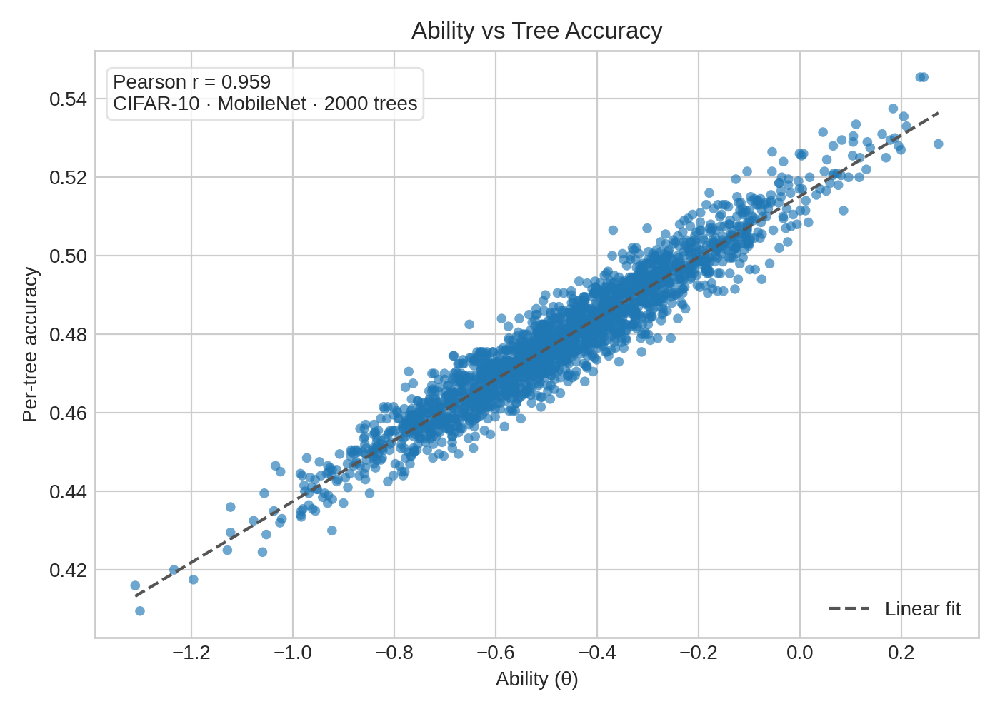
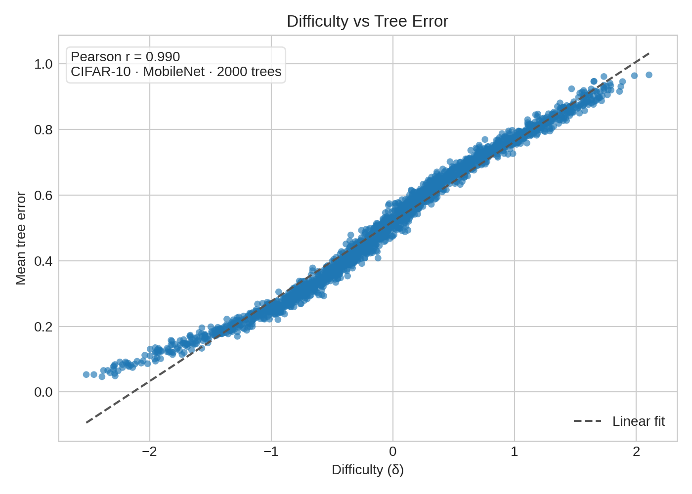
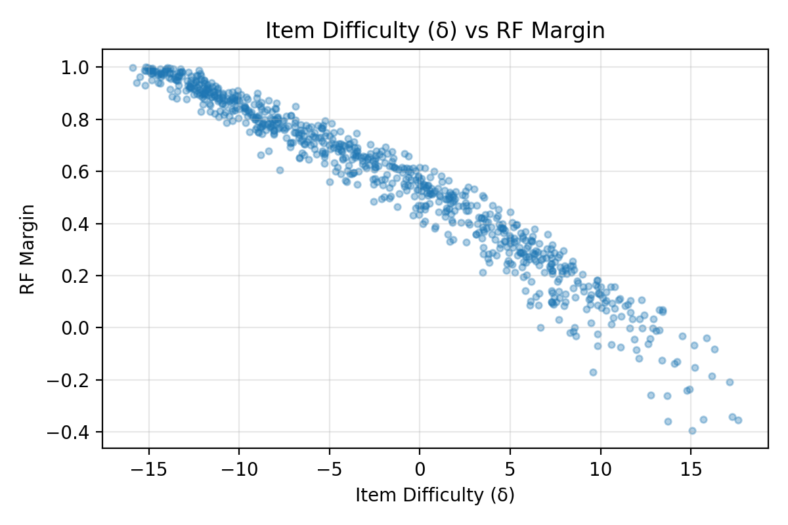
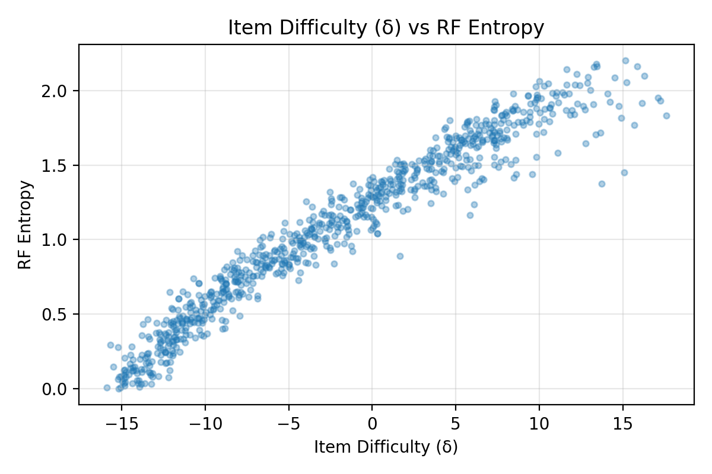

---

marp: true
theme: default
class: invert
paginate: true
math: katex

style: |
  section {
    font-size: 160%;
  }
  pre {
    vertical-align: text-top;
    font-size: 60%;
    line-height: 1.0;
  }
  .columns {
    display: flex;
    gap: 1em;
  }
  .col {
    flex: 1;
  }
---

# Random Forest × Item Response Theory

- Trees become respondents, images become items.
- Response matrix records per-tree correctness on held-out examples.
- Goal: explain RF behavior via IRT ability & difficulty signals.

---

# Motivation & Guiding Questions

- Why do some trees in a strong ensemble still behave erratically?
- Which images systematically confuse the forest, and can we surface them automatically?
- How do richer features shift the balance between tree skill (θ) and item difficulty (δ)?
- Use IRT to translate random forest signals into actionable curation insights.

---

# Story Arc

1. **Background:** IRT mechanics + RF diagnostics we rely on.
2. **Pipeline:** Datasets, embeddings, and response matrices powering the studies.
3. **Case Studies:** Baseline CIFAR, MobileNet upgrade, and MNIST control.
4. **Synthesis:** Cross-study comparisons, takeaways, and next steps.

---

# Why Item Response Theory for Random Forests?

- Treat each tree as a “test taker” answering every held-out image.
- Latent **ability** ($\theta$) separates reliable trees from drifted or shallow ones.
- Latent **difficulty** ($\delta$) surfaces mislabeled or ambiguous images without manual review.
- Shared scale lets us compare studies, backbones, and curation strategies apples-to-apples.

---

# Item Response Theory Building Blocks

  

**Core Terms**

- Ability ($\theta$): respondent skill; higher → better odds of a correct answer.
- Difficulty ($\delta$): item hardness; higher → harder even for strong respondents.
- Discrimination ($a$): slope of the logistic curve near $\delta$.
- Guessing ($c$): lower bound for multiple-choice exams (rare in our setup).

  

  

**Ensemble Analogy**

- Respondents → decision trees evaluated on a common test set.
- Items → images; responses are binary (tree got it right?).
- Response matrix $R_{ij} \in \{0,1\}$ fuels variational IRT fitting.
- Outputs: distributions over $\theta_i$ and $\delta_j$ plus information curves.

  

---

# Rasch (1PL) Model in One Picture

  

$$\Pr(R_{ij}=1 \mid \theta_i, \delta_j) = \frac{1}{1 + e^{- (\theta_i - \delta_j)}}$$

- Single global slope ensures parameters live on a shared logit scale.
- $(\theta - \delta) = 0$ ⇒ 50% chance of success; shifts left/right flip odds.
- Fisher information peaks where curves are steepest → ideal for spotting uncertain regions.

  

  

    
    
1PL logistic curves for items of varying difficulty

  

---

# What We Extract from IRT

- **Ability histograms**: flag inconsistent or low-skill trees worth pruning.
- **Difficulty ladders**: highlight ambiguous or mislabeled items for relabeling.
- **Wright maps**: overlay $\theta$ and $\delta$ to see coverage gaps.
- **Information curves**: identify where ensemble confidence is fragile.
- These diagnostics complement RF metrics by focusing on *who* struggles and *why*.

---

# Random Forest Mechanics (Deeper Dive)

  

**Bootstrap Aggregation**

- Sample $n$ examples with replacement per tree; leave-one-out OOB estimates follow.
- Feature subsampling at each split decorrelates trees and trims variance.
- Majority vote or probability averaging reduces variance relative to any single tree.

  

  

**Hyperparameters that Matter**

- $n_{trees}$ controls variance reduction ceiling.
- Max depth / min samples per leaf shape bias vs variance.
- Max features governs how diverse each tree becomes.
- Class weights & sample balancing steer towards rare classes.

  

---

# CART Splits & Gini Impurity

- Trees grow by selecting the feature/threshold minimizing impurity after the split.
- **Gini impurity** for node $t$ with class proportions $p_k$:

$$G(t) = 1 - \sum_k p_k^2$$

- Split gain: $\Delta G = G(t) - \sum_{child} \frac{|t_{child}|}{|t|} G(t_{child})$.
- Alternative is entropy $H(t) = -\sum_k p_k \log p_k$; we track both for diagnostics.
- Deep nodes with tiny $|t|$ overfit; pruning or depth limits keep signals meaningful.

---

# Margins, Entropy, and Ensemble Confidence

- **Margin**: $m(x) = P(\hat{y}=y_{true}) - \max_{c \neq y_{true}} P(\hat{y}=c)$.
  - Near 0 → ambiguous votes; negative → systematic misclassification.
- **Entropy** over class probabilities captures total disagreement across trees.
- Pairing $m(x)$ and entropy with $\delta$ spots mislabeled or out-of-distribution examples.
- Track margin trajectories per item to measure progress after curation.

---

# Variable Importance Playbook

- **Mean decrease in impurity (MDI)**: sum of Gini drops attributable to each feature.
- **Permutation importance**: shuffle feature $k$, re-score; larger drops → higher reliance.
- **SHAP / local attributions**: optional, clarify per-item influence.
- Cross-study comparison of importance vectors reveals when new embeddings truly shift focus.
- Coupled with IRT, we can ask whether hard items lack salient features or trees misuse them.

---

# Pipeline Recap

  

**Data Prep (done)**

- Stratified CIFAR-10 subset: 10k train / 2k val / 2k test.
- Resize 64×64, normalize, PCA → 128-D embeddings.
- Cached artifacts in `data/cifar10_subset.npz` + `data/cifar10_embeddings.npz`.

  

  

**Modeling Status**

- RF (200 trees) trained; metrics + importances saved.
- Response matrix `(200 × 2000)` persisted for IRT.
- 1PL Rasch fit (SVI, 600 epochs) complete.

  

---

# Dataset Overview

| Dataset | Train | Val | Test | Feature Pipeline | Notes |
|---|---|---|---|---|---|
| CIFAR-10 subset | 10,000 | 2,000 | 2,000 | 64×64 RGB → PCA-128 or MobileNet-V3 (960-D) | Shared splits across Study I & II |
| MNIST mini | 4,000 | 800 | 800 | 28×28 grayscale → raw pixels (no PCA) | Sanity check for clean handwriting |

- All studies reuse cached artifacts under `data/` for reproducibility.
- CIFAR runs differ only in embedding backbone (PCA vs MobileNet); labels & splits stay fixed.
- MNIST mini-study mirrors the workflow to confirm signals transfer to simpler data.

---

# Section I · Baseline Study (CIFAR + PCA)

- Establish reference performance with lightweight PCA embeddings.
- Inspect how IRT parameters align with classic RF uncertainty signals.
- Identify pain points to motivate stronger features.

---

# Study I: CIFAR-10 + PCA-128 Embeddings

- Baseline vision setup: 64×64 resize + PCA to 128 dims.
- 200-tree Random Forest trained on embeddings; response matrix size 200 × 2000.
- Use this run to introduce IRT diagnostics and identify weak spots.

---

# Study I Setup: CIFAR-10 + PCA-128

  

    <ul>
      <li>CIFAR-10 subset (10k / 2k / 2k) with stratified sampling and fixed seed.</li>
      <li>Preprocess: resize 64×64, normalize, PCA → 128-D embeddings (`data/cifar10_embeddings.npz`).</li>
      <li>Response matrix shape 200 × 2000 with mean tree accuracy 0.176.</li>
      <li>Artifacts: metrics, margins, entropy, and IRT outputs stored under `data/` & `figures/` root.</li>
    </ul>
  

  

    
    
Study I sample grid — stratified CIFAR-10 slices

  

---

# Study I Performance (PCA-128)

| Metric | Value |
|---|---|
| Test / Val / OOB acc | 0.4305 / 0.4145 / 0.3730 |
| Per-class range | 0.225 (cat) → 0.595 (ship) |
| Mean tree accuracy | 0.1759 |
| Mean margin / entropy | −0.0028 / 2.1503 |
| δ ↔ margin (Pearson) | −0.8286 |
| δ ↔ entropy (Pearson) | 0.6782 |

- Baseline ensemble underperforms due to weak PCA features yet preserves δ alignment.
- Low mean margin + high entropy indicate broad tree disagreement → fertile ground for IRT.
- Artifacts: metrics (`data/rf_metrics.json`), confusion (`data/rf_confusion.npy`), importances, permutations.

---

# Study I Confusion Matrix

  

    
  

  

**Reading the matrix**

- High off-diagonal mass for cat ↔ dog, bird ↔ airplane, horse ↔ deer.
- Ships and trucks maintain >80% normalized diagonal despite shared structure.
- Hotspots align with IRT δ spikes (slides that follow), signalling data curation targets.

  

---

# Study I Diagnostics: Ability Profiles

  

    
    
Ability (θ) vs tree accuracy — Spearman ≈ 0.99

  

  

    
    
Wright map: θ cluster near −11; δ stretches to 14

  

- Trees with θ above −10 outperform peers by ~3 pp even with PCA features.
- Long tail of low-ability trees (< −11.5) drags ensemble accuracy; pruning candidates.
- Wright map shows limited θ spread versus broad δ tail → feature quality bottleneck.

---

# Study I Diagnostics: δ vs Error Rate

  

    
  

  

- δ > 10 corresponds to averaged tree error >80%, mostly ambiguous animals.
- Items with δ < 0 are “free points” — nearly every tree agrees.
- Pearson ≈ 0.95, Spearman ≈ 0.94. Difficulty doubles as an error heat-map.

  

---

# Study I Diagnostics: δ vs RF Signals

  

    
    
PCA run: δ vs margin (Pearson −0.83)

  

  

    
    
PCA run: δ vs entropy (Pearson 0.68)

  

- Hard items cluster bottom-right (low margin, high entropy) → ripe for relabeling or augmentation.
- Opposite corner contains “easy wins” with positive margin and low entropy.
- Study II mirrors these plots with MobileNet features, pushing |corr| above 0.80.

---

# Study I Evidence: Hard vs Easy Examples

  

  

  

  

- Hardest items skew toward ambiguous airplane/ship silhouettes and cluttered cat/dog scenes.
- Notice recurring mislabeled-looking ships (δ ≈ 14) flagged for manual review.
- Easy set dominated by deterministic cues (red fire trucks, high-contrast ships) → low δ and entropy.

---

# Study I Takeaways

- Weak PCA features create long tails in both ability (θ) and difficulty (δ), exposing erratic trees.
- Margin and entropy correlate with δ, but clusters of high-difficulty animals persist across diagnostics.
- Visual inspection confirms mislabeled or low-signal items driving high δ, motivating feature upgrades.

---

# Section II · Feature-Rich CIFAR (MobileNet)

- Hold data splits constant to isolate backbone improvements.
- Expect tighter ability spread and stronger δ alignment with RF confidence.
- Validate whether ambiguous animal classes persist after feature upgrade.

---

# Study II: CIFAR-10 + MobileNet Embeddings

- Swap PCA features for MobileNet-V3 (960-D) while keeping tree count and splits constant.
- Measure how richer features alter RF metrics, margins/entropy, and IRT parameter spreads.
- Use as a reality check before expanding to new datasets.

---

# Study II Setup: CIFAR-10 + MobileNet-V3

  

    <ul>
      <li>Reuse CIFAR-10 subset splits from Study I to isolate feature effects.</li>
      <li>Extract 960-D embeddings from pretrained MobileNet-V3 Small (`data/cifar10_mobilenet_embeddings.npz`).</li>
      <li>Response matrix shape 200 × 2000 with mean tree accuracy 0.482.</li>
      <li>Dedicated artifacts: `data/mobilenet/*`, plots in `figures/mobilenet/`.</li>
    </ul>
  

  

    
    
Study II sample grid — same splits, MobileNet embeddings

  

---

# Study II Performance (MobileNet-V3)

| Metric | Value |
|---|---|
| Test / Val / OOB acc | 0.8090 / 0.8135 / 0.7967 |
| Per-class range | 0.68 (cat) → 0.915 (ship) |
| Mean tree accuracy | 0.4817 |
| Mean margin / entropy | 0.2806 / 1.4663 |
| δ ↔ margin (Pearson) | −0.8825 |
| δ ↔ entropy (Pearson) | 0.8113 |

- Pretrained features boost accuracy by 37 pp while strengthening δ correlations.
- Higher margins + lower entropy show confidence gains except on stubborn animal classes.
- Artifacts live under `data/mobilenet/` (metrics, response matrix, signals, IRT outputs).

---

# Study II Diagnostics: δ vs RF Signals

  

    
    
δ vs margin (Pearson −0.88)

  

  

    
    
δ vs entropy (Pearson 0.81)

  

- MobileNet compresses the easy cluster (high margin, low entropy) while isolating true hard cases.
- Higher correlation magnitudes indicate better alignment between δ and RF uncertainty signals.
- Cat/dog confusions persist despite stronger features → candidates for targeted curation.

---

# Study II Diagnostics: Ability Profiles

  

    
    
Ability (θ) vs tree accuracy — Pearson 0.983

  

  

    
    
Wright map: θ variance shrinks to 0.25

  

- θ mean −0.21 ± 0.25: trees cluster closer together than PCA baseline (σ 0.55 → 0.25).
- Ability remains tightly coupled to per-tree accuracy; even weakest trees clear 40%.
- Shared axis shows overlap where confident trees meet easy airplane/ship items.
- Ability compression signals that feature quality, not tree diversity, now limits performance.

---

# Study II Diagnostics: δ vs Error Rate

  

    
  

  

- Pearson 0.922: δ remains strongly aligned with mean tree error despite higher accuracy ceiling.
- Hardest items (δ > 8) persist from PCA run — mostly cat/dog overlaps and ambiguous aircraft.
- Easy zone (δ < −3) expands, showing MobileNet features unlock more “free points.”

  

---

# Study II Takeaways

- MobileNet embeddings boost accuracy by 37 pp while collapsing ability variance (σθ 0.55 → 0.25).
- δ remains correlated with RF uncertainty, concentrating hard cases into a smaller ambiguous cluster.
- Residual cat/dog confusion suggests future gains must come from data curation, not just features.

---

# Section III · Control Study (MNIST)

- Probe pipeline behavior on a high-signal, low-noise dataset.
- Confirm that IRT still mirrors RF uncertainty when accuracy is near perfect.
- Use as guardrail before applying to additional tabular or vision datasets.

---

# Study III: MNIST Mini-Study

- Lightweight handwriting dataset to validate RF × IRT beyond CIFAR-10.
- Serves as control: simpler classes, higher accuracy, clearer δ separation.
- Highlights how pipeline behaves when ambiguity is rare but still detectable.

---

# Study III Setup: MNIST Mini-Study

  

    <ul>
      <li>Split 4k / 800 / 800 digits with stratified sampling and fixed seed.</li>
      <li>Minimal preprocessing: 28×28 grayscale flattened; no augmentation.</li>
      <li>Random Forest (200 trees) trained on raw pixels; response matrix shape 200 × 800.</li>
      <li>Artifacts stored under `data/mnist/` with plots in `figures/mnist/`.</li>
    </ul>
  

  

    
    
Study III sample grid — curated MNIST mini split

  

---

# Study III Performance (MNIST)

| Metric | Value |
|---|---|
| Train / Val / Test | 4000 / 800 / 800 |
| RF test / val / OOB | 0.9475 / 0.9413 / 0.9140 |
| Mean margin / entropy | 0.5546 / 1.0351 |
| δ ↔ margin (Pearson) | −0.950 |
| δ ↔ entropy (Pearson) | 0.958 |
| θ mean ± σ | 4.23 ± 0.44 |
| δ mean ± σ | −1.75 ± 8.19 |

- Ambiguous digits (e.g., brushed 5 vs 6) spike δ toward ±20; trees vote confidently elsewhere.
- Reinforces link between low entropy, high margin, and low δ on clean handwriting data.
- Provides a “sanity benchmark” to validate the RF × IRT pipeline outside CIFAR.

---

# Study III Diagnostics: δ vs RF Signals

  

    
    
δ vs margin (Pearson −0.95)

  

  

    
    
δ vs entropy (Pearson 0.96)

  

- Clean digits show near-perfect alignment between IRT difficulty and RF uncertainty signals.
- Low scatter indicates only a handful of items drive ensemble uncertainty.
- Marks δ > 12 digits for manual audit (stroke collisions, 3 vs 5, 4 vs 9).

---

# Study III Diagnostics: Ability Profiles

  

  

    
    
Ability (θ) vs tree accuracy — Pearson 0.995

  

  

  

  

    
    
Wright map: θ mean 4.23 ± 0.44; δ mean −1.75 ± 8.19

  

  

- θ mean 4.23 ± 0.44: trees quickly separate easy digits, reflecting high consensus.
- δ mean −1.75 ± 8.19 with heavy tails on ambiguous strokes.
- Shared scale shows abundant overlap → most items are easy wins with a few hard spikes.
- Provides contrast against CIFAR studies where ability mass sat below zero.

---

# Study III Diagnostics: δ vs Error Rate

  

    
  

  

- Pearson 0.962: δ spikes pinpoint the rare ambiguous digits despite overall high accuracy.
- Outliers (δ > 12) correspond to stroke-collided 3/5/8 and 4/9 pairs flagged for curation.
- Long negative tail shows the majority of digits are trivial for the ensemble.

  

---

# Study III Takeaways

- Clean digits yield near-perfect agreement between δ and RF uncertainty metrics.
- Ability scores stay high yet retain enough variance to flag the rare ambiguous strokes.
- Control study validates that the RF × IRT pipeline generalizes beyond noisy vision data.

---

# Section IV · Cross-Study & Diagnostics

- Compare backbones and datasets on a shared θ/δ scale.
- Surface themes that repeat across studies before diving into supporting diagnostics.
- Set the stage for consolidated takeaways and action items.

---

# Cross-Study Snapshot

| Study | Feature Backbone | Test Acc | δ ↔ margin (Pearson) | δ ↔ entropy (Pearson) | θ σ | δ σ |
|---|---|---|---|---|---|---|
| Study I: CIFAR + PCA-128 | PCA-128 | 0.4305 | −0.8286 | 0.6782 | 0.55 | 4.10 |
| Study II: CIFAR + MobileNet | MobileNet-V3 (960-D) | 0.8090 | −0.8825 | 0.8113 | 0.25 | 4.67 |
| Study III: MNIST Mini | Raw pixels | 0.9475 | −0.950 | 0.958 | 0.44 | 8.19 |

- Feature backbone drives both accuracy gains and δ alignment strength.
- θ variance collapses with MobileNet (0.25) indicating tree consistency; MNIST keeps moderate spread despite high accuracy.
- MNIST δ σ expands to 8.19, highlighting rare but extreme digit ambiguities versus CIFAR’s visual noise.

---

# Key Takeaways

- IRT mirrors random forest uncertainty: θ aligns with per-tree accuracy and δ with item error across every study.
- Feature backbones reshape the θ/δ landscape—MobileNet curbs tree variance while preserving a hard-item tail.
- Combining δ with margins and entropy cleanly triages ambiguous animal classes without manual inspection.
- Control datasets like MNIST confirm the pipeline generalizes beyond noisy vision data before we branch out further.

---

# Next Steps

- Expand notebooks to auto-export the comparison tables and montage panels featured here.
- Run planned 2PL/3PL experiments (see `reports/discrimination_analysis_plan.md`) to capture discrimination effects.
- Correlate tree ability with structural traits (depth, leaf count) to prioritize pruning or retraining.
- Scale the δ + margin triage to curate ambiguous CIFAR items and validate on upcoming tabular studies.

---

# Appendix · Extended Diagnostics

- Supplemental slides for reference during Q&A or deep dives.
- Includes tabular baselines, training curves, and class-level breakdowns.
- Safe to skip on first pass; revisit as questions arise.

---

# IRT Fit (Study I Baseline, 1PL 600 epochs)

- Optimizer: Adam lr=0.05, SVI Trace_ELBO, seed=7.
- Final loss: **1.50M** (down from 165M at init).
- Tree ability (θ): mean −11.14, σ 0.55, range [−12.79, −9.68].
- Item difficulty (δ): mean 5.90, σ 4.10, range [−10.74, 14.26].
- Correlations — ability ↔ tree accuracy **0.999**, difficulty ↔ item error **0.950**.
- Cross-check: embedding & MNIST tables confirm these correlations persist across datasets.

Diagnostic JSON: `data/irt_summary.json`, extremes in `data/irt_extremes.json`.

---

# Edge Cases Across Datasets

- **CIFAR-10 (PCA):** δ tail contains grayscale ships + occluded pets. Margin < −0.2, entropy > 2.2.
- **CIFAR-10 (MobileNet):** Outliers shrink but persist for cat/dog overlap; δ still > 8 despite cleaner features.
- **MNIST:** High δ digits stem from stroke noise (e.g., 9 vs 4). Entropy jumps above 1.9 only for these cases.
- Actionable: focus audits on items with δ > 8 + low margins; they recur across embeddings.

---

# Class Difficulty vs RF Error

  

- Cats, horses, dogs exhibit δ ≈ 7–8 with RF error ≥ 0.60, marking priority classes for curation.
- Ships and airplanes remain easiest: δ ≈ 4 with RF error ≤ 0.46.
- Aligning δ with RF error spotlights where ensemble uncertainty mirrors misclassification hotspots.
  

  

  

---

# Training Loss & Distributions

  

  

  

  

  

