---

marp: true
theme: default
paginate: true
math: katex
style: |
  section {
    font-size: 140%;
    width: 1280px;
    height: 720px;
    padding-top: 40px;
    padding-bottom: 40px;
    padding-left: 100px;
    padding-right: 100px;
  }
  ul {
    line-height: 1.2;
  }
  li {
    margin-bottom: 0em;
  }
  pre {
    vertical-align: text-top;
    font-size: 60%;
    line-height: 1.0;
  }
  .columns {
    display: flex;
    gap: 1em;
  }
  .col {
    flex: 1;
  }
  img {
    border-radius: .2em;
  }
footer: ATS © 2025, CC-BY 4.0
---

# IRTForests 

Andrew T. Scott, Fall 2025

<a href="https://github.com/ascott02/IRTForests">github.com/ascott02/IRTForests</a>

---

# Item Response Theory + Random Forests

- Trees become respondents, images become items.
- Response matrix records per-tree correctness on held-out examples.
- Goal: explain RF behavior via IRT ability & difficulty signals and vice versa.

---

# Agenda

- Background: IRT + RF primers
- Pipeline: datasets, embeddings, and response matrices
- Case studies: CIFAR (PCA), CIFAR (MobileNet), MNIST
- Cross-study comparison, 2PL/3PL updates, takeaways, next steps

---

# Item Response Theory (IRT) (Wilson, 2005)

**Why? Because performance != ability — but they’re related.**

- Classical Test Theory (CTT) tells us *how someone did on this test.*

- IRT models *how someone would perform on any set of items that measure the same underlying ability*.

- IRT doesn’t replace CTT, it generalizes it with **portable, interpretable measurements** of capability.

| CTT | IRT |
|-----------------------|----------------------|
| Measures perf. on specific test | Estimates underlying ability |
| Test = sample of items | Items = samples from a calibrated continuum |
| Precision assumed constant | Precision varies with ability |
| Great for grading | Great for understanding and interpretability |

> A joint calibration framework where ability and difficulty are inferred together, each defined only in relation to the other. 
> It’s less like grading individuals and more like synchronizing clocks — each calibrated against the ensemble.

---

# Item Response Theory Building Blocks

  

## **Core Terms**

- Ability (θ): respondent skill; higher → higher success odds (1PL).
- Difficulty (δ): item hardness; higher → harder even for strong respondents (1PL).
- Discrimination (𝑎): slope near δ (2PL).
- Guessing (𝑐): floor for multiple-choice exams (3PL).

  

  

## **Forest Analogy**

- Respondents → decision trees on a shared test set.
- Items → images; responses are binary (tree correct?).
- Response matrix $R_{ij} \in \{0,1\}$ feeds variational IRT.
- Outputs: posteriors over θᵢ, δⱼ, and information curves.

  

---

# Rasch (1PL) Model in One Picture

  

$$\Pr(R_{ij}=1 \mid \theta_i, \delta_j) = \frac{1}{1 + e^{- (\theta_i - \delta_j)}}$$

- The probability a respondent gets the item correct, given their ability, and the item's difficulty.
- Single global slope keeps parameters on a shared logit scale.
- θ − δ = 0 ⇒ 50% success; shifts left/right change odds.
- Fisher information peaks where curves are steepest.
- See <a href="https://ascott02.github.io/irt.html">IRT ICC Visualizer</a> for 2PL, 3PL, 4PL

  

  

  

    
    
1PL Item Characteristic Curves (ICC)

    

  

---

# IRT Output

- **Ability histograms** flag low-skill trees worth pruning.
- **Difficulty ladders** highlight mislabeled or ambiguous items.
- **Wright maps** overlay θ and δ to expose coverage gaps.
- **Information curves** reveal where ensemble confidence is fragile.
- Together they explain *who* struggles and *why*, beyond RF metrics.

---

# Random Forests — Many Noisy Trees, One Stable Voice (Breiman, 2001)

- Train trees on bootstrapped samples with random feature subsets to decorrelate their votes.
- Aggregate those votes by majority (classification) or mean (regression) to cut variance.
- **Margin:** gap between the correct class and the runner-up; **entropy:** dispersion of votes.
- Reading the two together exposes how confident—or conflicted—the forest is, especially once aligned with δ.

---

# Random Forest Margins — How Confident Is the Crowd?

$$ \text{margin}(x_i) =
P_{\text{correct}}(x_i)
- \max_{j \neq \text{true}} P_j(x_i) $$

The **margin** measures how far ahead the correct class is over its nearest competitor.

- **High margin:** trees vote strongly for the right class → confident.  
- **Low or negative margin:** trees disagree or favor another class → uncertain.  

> Think of it as the *vote gap* in an election — the wider the gap, the clearer the win.

---

# Ensemble Entropy — How Much Do Trees Disagree?

$$ H(x_i) = - \sum_j P_j(x_i) \log_2 P_j(x_i) $$

The **entropy** measures how dispersed the votes are across classes.

- **Low entropy:** trees nearly unanimous → decisive prediction.  
- **High entropy:** votes spread out → uncertainty or class confusion.  

> Within trees, entropy drives splits (purity).  
> Across trees, entropy reveals disagreement — the forest’s collective uncertainty.

---

# GenAI in the Loop Scientific Experimentation

- Recursive prompting (akin to <a href="https://www.anthropic.com/engineering/effective-context-engineering-for-ai-agents">context engineering</a>) keeps each iteration scoped.
- Ground every cycle in the `README.md` spec—goals, datasets, diagnostics.
- Automate the CLI so runs regenerate figures and tables straight into the deck.
- Commit, push, repeat: <a href="https://github.com/ascott02/IRTForests">github.com/ascott02/IRTForests</a>

> Plastic tubes and pots and pans
> Bits and pieces and the magic from the hand - Oingo Boingo, "Weird Science" 1985

---

# Pipeline Overview

  

**Data preparation for three studies**

1. Stratified CIFAR-10 subset: 10k / 2k / 2k splits. Resize 64×64, normalize, PCA → 128-D embeddings.
2. Stratified CIFAR-10 subset: 10k / 2k / 2k splits. Resize 64×64, normalize, MobileNet → 960-D embeddings.
3. MNIST mini: 4k / 800 / 800 digits, normalized 28×28 grayscale. Raw pixels.

**Random forest training**

- RF (2000 trees) trained for every study; metrics and importances saved.
- Response matrices saved: CIFAR `(2000 × 2000)` for PCA & MobileNet, MNIST `(2000 × 800)`.

**IRT analysis**
- 1PL Rasch (SVI, 600 epochs) complete for CIFAR+PCA, CIFAR+MobileNet, and MNIST.
- 2PL (SVI, 800 epochs) complete for CIFAR+PCA, CIFAR+MobileNet, and MNIST.
- 3PL (SVI, 1000 epochs) CIFAR MobileNet only.

  

---

# Datasets Overview

| Dataset | Train | Val | Test | Feature Pipeline | Notes |
|---|---|---|---|---|---|
| CIFAR-10 subset | 10,000 | 2,000 | 2,000 | PCA-128 / MobileNet-V3 (960-D) | Shared splits Study I & II |
| MNIST mini | 4,000 | 800 | 800 | 28×28 grayscale → raw pixels (no PCA) | Control for clean handwriting |

- CIFAR runs differ only by embeddings; labels and splits stay fixed.
- MNIST mirrors the workflow to confirm signals on cleaner data.

---

# Study I: CIFAR-10 + PCA-128 Embeddings

---

# Study I Setup: CIFAR-10 + PCA-128

  

    <ul>
  <li>Establish the PCA baseline and capture RF uncertainty signals.</li>
  <li>Use IRT to pinpoint weak trees and hard items that motivate stronger features.</li>
  <li>Fix a stratified CIFAR-10 split (10k / 2k / 2k).</li>
  <li>Train 2000 trees and score them on the shared test set.</li>
  <li>Build a 2000 × 2000 response matrix (mean tree accuracy ≈ 0.18).</li>
  <li>Artifacts: metrics, margins, entropy, IRT outputs.</li>
    </ul>
  

  

  

Study I sample grid — stratified CIFAR-10 slices

    

  

---

# Study I Performance (PCA-128)

| Metric | Value |
|---|---|
| Test / Val / OOB acc | 0.468 / 0.470 / 0.442 |
| Per-class range | 0.260 (bird) → 0.635 (ship) |
| Mean tree accuracy | 0.1763 |
| Mean margin / entropy | 0.0058 / 2.1723 |
| δ negatively correlates with margin (Pearson) | −0.815 |
| δ positively correlates with entropy (Pearson) | 0.687 |

- Baseline ensemble still underperforms due to weak PCA features yet preserves δ alignment.
- Margins hover near zero (mean ≈0.006) and entropy stays high (2.17), signalling broad disagreement—prime for IRT.

---

# Study I Confusion Matrix

  

    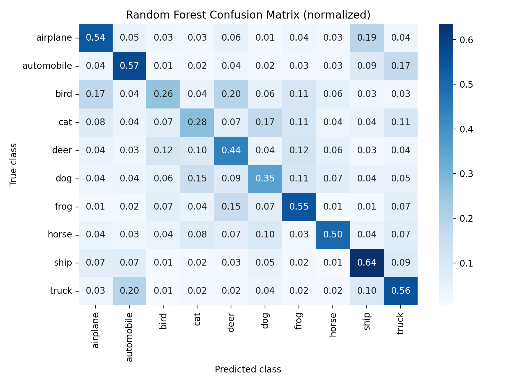
  

  

- Off-diagonal spikes (cat vs dog, bird vs airplane, horse vs deer) mirror high-δ items.
- Ships and trucks still lead the diagonal (≈64% / 56% accuracy), yet well short of a clean block—further underscoring the curation need.

  

---

# Study I Diagnostics: Ability Profiles

  

  

    
    
Ability (θ) vs tree accuracy — Spearman ≈ 0.99

    

  

  

  

  
  
Wright map: θ mean ≈ −11.0 (σ ≈ 0.56); δ mean ≈ 5.8 with a wide tail

    

  

- θ ranges from about −12.8 to −8.9 (mean ≈ −11.0 ± 0.56), so even small shifts separate stronger trees by a few percentage points.
- δ centers near 5.8 but stretches from roughly −11.5 to 13.4, highlighting how ambiguous animal items sit far from the easy tail.

---

# Study I Diagnostics: δ vs Error Rate

  

    
  

  

- δ > 0.4 maps to >80% tree error—mostly ambiguous animals—while δ < −0.3 becomes “free points.”
- Pearson ≈ 0.87, Spearman ≈ 0.86: difficulty doubles as an error heat-map.

  

---

# Study I Diagnostics: δ vs RF Signals

  

  

  
  
PCA run: δ vs margin (Pearson −0.82)

    

  

  

  

  
  
PCA run: δ vs entropy (Pearson 0.69)

    

  

- Hard items cluster bottom-right (low margin, high entropy); opposite corner houses easy wins.
- Study II mirrors the trend with even stronger correlations.

---

# Study I Evidence: Hard vs Easy Examples

  

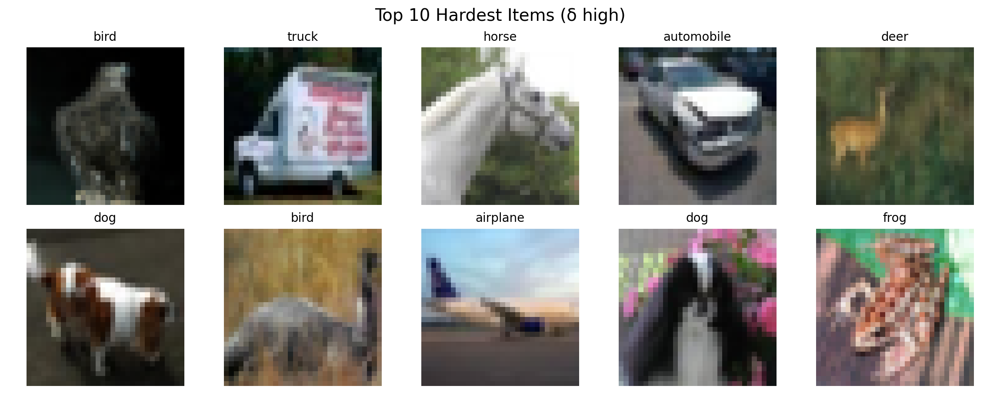

  

  

  

- Hardest items skew toward ambiguous airplane/ship silhouettes and cluttered cat/dog scenes.
- Easy set is dominated by high-contrast cues (e.g., red fire trucks), yielding low δ and entropy.

---

# Study I Fit Checks & Edge Cases

  

**Fit diagnostics**

| Metric | Value |
|---|---|
| Item infit μ / p95 | 0.18 / 0.35 |
| Item outfit μ / p95 | 0.18 / 0.34 |
| Tree infit μ / p95 | 0.35 / 0.48 |
| Tree outfit μ / p95 | 0.18 / 0.19 |

- MSQs well below 1 show tree responses are steadier than a pure Rasch prior; |z| never exceeds 0.05.

  

  

**Edge cases worth a look**

- `#118` bird → deer votes (δ ≈ 13.4, margin ≈ −0.05, entropy ≈ 2.28).
- `#1734` truck → cat/frog split (δ ≈ 13.2, margin ≈ −0.09, entropy ≈ 2.27).
- `#1602` horse → dog/horse tie (δ ≈ 13.2, margin ≈ −0.11, entropy ≈ 2.22).

- Each item sits below 9% tree accuracy—prime targets for relabeling or curated augmentations.

    
    
Study I edge cases · IDs 118, 1734, 1602

  

---

# Study I Takeaways

- Weak PCA features create long tails in both ability (θ) and difficulty (δ), exposing erratic trees.
- Margin and entropy correlate with δ, but clusters of high-difficulty animals persist across diagnostics.
- Visual inspection confirms mislabeled or low-signal items driving high δ, motivating feature upgrades.

---

# Study II: CIFAR-10 + MobileNet Embeddings

---

# Study II Setup: CIFAR-10 + MobileNet-V3

  

- Hold the splits fixed to isolate feature gains.
- Swap PCA features for MobileNet-V3 (960-D) while keeping tree count and splits constant.
- Test whether richer embeddings tighten θ spread and retain δ alignment.
- Compare RF metrics, uncertainty signals, and IRT parameters against the baseline.

  

  

    
    
Study II sample grid — same splits, MobileNet embeddings

  

---

# Study II Performance (MobileNet-V3)

| Metric | Value |
|---|---|
| Test / Val / OOB acc | 0.819 / 0.820 / 0.812 |
| Per-class range | 0.695 (bird) → 0.925 (ship) |
| Mean tree accuracy | 0.4792 |
| Mean margin / entropy | 0.2806 / 1.4929 |
| δ negatively correlates with margin (Pearson) | −0.950 |
| δ positively correlates with entropy (Pearson) | 0.881 |

- Pretrained features boost accuracy by 35 pp while strengthening δ correlations.
- Higher margins and lower entropy show confidence gains except on stubborn animal classes.
- Artifacts: metrics, response matrix, signals, and IRT outputs under `data/mobilenet/`.

---

# Study II Diagnostics: δ vs RF Signals

  

  

    
  
δ vs margin (Pearson −0.95)

  

  

  

  

    
  
δ vs entropy (Pearson 0.88)

  

  

- MobileNet compresses the easy cluster (high margin, low entropy) while isolating true hard cases.
- Larger |corr| values show tighter agreement between δ and RF uncertainty.
- Cat/dog confusions persist, marking curation targets.

---

# Study II Diagnostics: Ability Profiles

  

  

    
  
Ability (θ) vs tree accuracy — Pearson 0.96

  

  

  

  

    
  
Wright map: θ ≈ −0.46 ± 0.23; δ spans ±2.1

  

  

- θ mean −0.46 ± 0.23 keeps the ensemble tightly banded while still ranking trees cleanly.
- Ability remains tied to per-tree accuracy, so feature quality—rather than tree diversity—now caps gains.

---

# Study II Diagnostics: δ vs Error Rate

  

    
  

  

- Pearson 0.99 keeps δ aligned with mean tree error even at the higher accuracy ceiling.
- Hardest items (δ > 1.5) persist—mostly cat/dog overlaps and ambiguous aircraft—while the easy zone (δ < −1) expands.

  

---

# Study II Evidence: Hard vs Easy Examples

  

  

  

  

- MobileNet tightens easy clusters yet the same cat/dog outliers survive with δ > 1.5.
- Easy wins sharpen into high-contrast ships and trucks, showing how feature upgrades cleanly separate low-δ items.

---

# Study II Fit Checks & Edge Cases

  

**Fit diagnostics**

| Metric | Value |
|---|---|
| Item infit μ / p95 | 0.27 / 0.37 |
| Item outfit μ / p95 | 0.27 / 0.37 |
| Tree infit μ / p95 | 0.29 / 0.31 |
| Tree outfit μ / p95 | 0.27 / 0.29 |

- Narrow MSQ spread (≤0.37) confirms MobileNet trees behave consistently; no misfit flags at |z| > 0.05.

  

  

**Edge cases worth a look**

- `#1190` automobile → frog votes (δ ≈ 15.4, margin ≈ −0.22, entropy ≈ 1.85; top probs frog 0.28, deer 0.27).
- `#1196` bird → horse (δ ≈ 14.9, margin ≈ −0.38, entropy ≈ 1.31; horse 0.41, deer 0.41, bird 0.08).
- `#95` frog → bird (δ ≈ 14.8, margin ≈ −0.25, entropy ≈ 1.89; bird 0.32, deer 0.20, frog 0.17).

- These persistent outliers survive the feature upgrade—queue them for image/label review next.

    
    
Study II edge cases · IDs 1190, 1196, 95

  

---

# Study II Takeaways

- MobileNet embeddings add 35 pp of accuracy while maintaining a focused ability band (Std(θ) ≈ 0.23).
- δ stays aligned with RF uncertainty, isolating a smaller yet stubborn ambiguous cluster.
- Residual cat/dog confusion points to data curation as the next lever.

---

# Section III · Control Study (MNIST)

---

# Study III Setup: MNIST Mini-Study

  

- Probe the pipeline on a high-signal, low-noise dataset.
- Use a lightweight handwriting set to validate RF × IRT beyond CIFAR-10.
- Confirm that IRT still mirrors RF uncertainty when accuracy is near perfect.
- Treat it as a control case where ambiguity is rare yet still detectable.

  

  

  

Study III sample grid — curated MNIST mini split

    

  

---

# Study III Performance (MNIST)

| Metric | Value |
|---|---|
| Train / Val / Test | 4000 / 800 / 800 |
| RF test / val / OOB | 0.954 / 0.944 / 0.939 |
| Mean margin / entropy | 0.5644 / 1.0768 |
| δ negatively correlates with margin (Pearson) | −0.975 |
| δ positively correlates with entropy (Pearson) | 0.970 |
| θ mean ± std | 3.04 ± 0.29 |
| δ mean ± std | −0.13 ± 0.47 |

- Ambiguous digits (e.g., brushed 5 vs 6) still spike δ toward the positive tail; elsewhere the forest is decisive.
- Low entropy + high margin line up with low δ, giving a “sanity benchmark” beyond CIFAR.

---

# Study III Diagnostics: δ vs RF Signals

  

    
  
δ vs margin (Pearson −0.97)

  

  

    
  
δ vs entropy (Pearson 0.97)

  

- Clean digits show near-perfect alignment between δ and RF uncertainty.
- Only a handful of δ > 1.2 digits drive the residual uncertainty (stroke collisions like 3/5, 4/9).

---

# Study III Diagnostics: Ability Profiles

  

  

    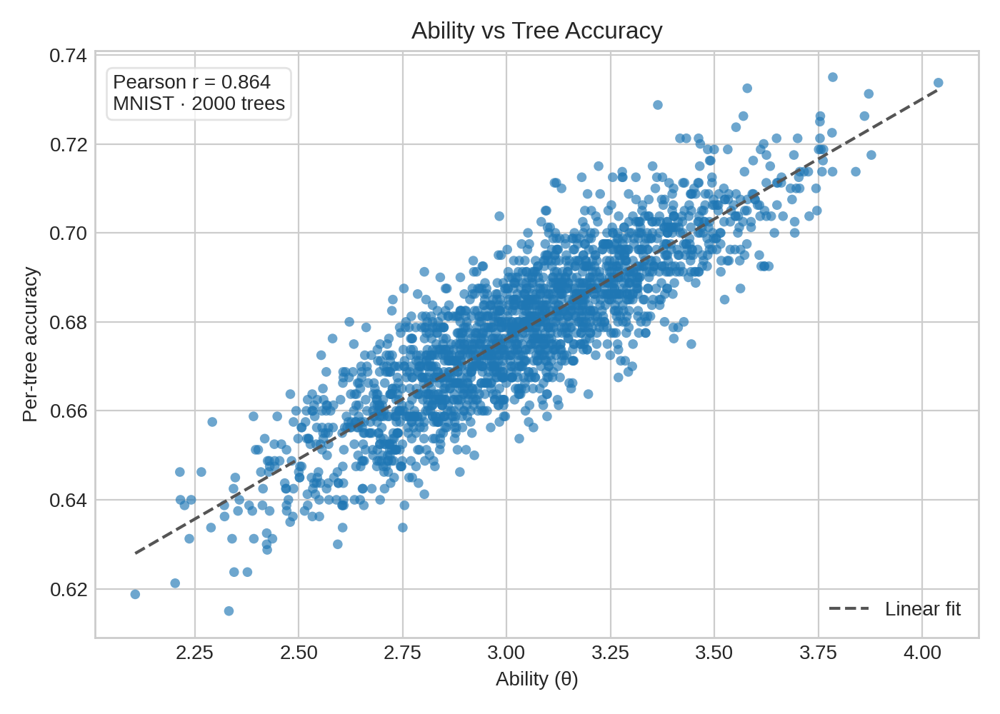
  
Ability (θ) vs tree accuracy — Pearson 0.98

  

  

  

  

    
  
Wright map: θ mean 3.04 ± 0.29; δ mean −0.13 ± 0.47

  

  

- θ mean 3.04 ± 0.29 shows strong consensus, while δ mean −0.13 ± 0.47 keeps a modest positive tail for ambiguous strokes.
- Shared scales expose plentiful easy wins with only a few sharp spikes—opposite of the CIFAR baseline.

---

# Study III Diagnostics: δ vs Error Rate

  

    
  

  

- Pearson 0.98 keeps δ tied to mean tree error despite the high accuracy ceiling.
- δ > 1.2 corresponds to stroke-collided 3/5/8 and 4/9 pairs; the long negative tail is trivial for the ensemble.

  

---

# Study III Evidence: Hard vs Easy Digits

  

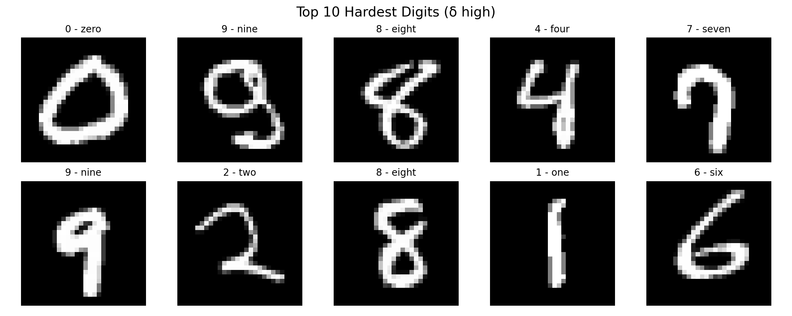

  

  

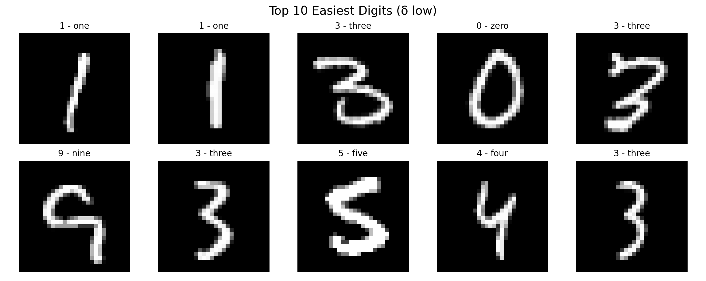

  

- Hardest digits show stroke collisions (3 vs 5, 4 vs 9) that push δ above 1 despite high margins elsewhere.
- Easy digits are crisp, centered strokes—useful anchors when explaining why δ plunges on most of the dataset.

---

# Study III Fit Checks & Edge Cases

  

**Fit diagnostics**

| Metric | Value |
|---|---|
| Item infit μ / p95 | 0.23 / 0.38 |
| Item outfit μ / p95 | 0.22 / 0.37 |
| Tree infit μ / p95 | 0.30 / 0.32 |
| Tree outfit μ / p95 | 0.22 / 0.25 |

- Rasch residuals stay tight (|z| < 0.07), confirming the control study’s consistency.

  

  

**Edge cases worth a look**

- `#296` digit 0 → vote 7 (δ ≈ 17.6, margin ≈ −0.35, entropy ≈ 1.83; top probs 7=0.38, 9=0.18, 4=0.16).
- `#151` digit 9 → vote 6 (δ ≈ 17.3, margin ≈ −0.34, entropy ≈ 1.93; top probs 6=0.39, 5=0.12, 2=0.10).
- `#708` digit 4 → vote 3 (δ ≈ 16.3, margin ≈ −0.08, entropy ≈ 2.10; top probs 3=0.19, 4=0.18, 9=0.15).

- Archive these strokes for a “confusing digits” gallery or curation playbook.

    
    
Study III edge cases · IDs 296, 151, 708

  

---

# Study III Takeaways

- δ and RF uncertainty agree almost perfectly, while θ stays high yet still flags the rare ambiguous strokes.
- The control study confirms the RF × IRT pipeline holds outside noisy vision data.

---

# Section IV · Cross-Study & Diagnostics

- Compare backbones and datasets on a shared θ/δ scale.
- Surface recurring themes before the close.

---

# Cross-Study Snapshot

<small>

| Study | Feature Backbone | Test Acc | δ negatively correlates with margin (Pearson) | δ positively correlates with entropy (Pearson) | Std(θ) | Std(δ) |
|---|---|---|---|---|---|---|
| Study I: CIFAR + PCA-128 | PCA-128 | 0.468 | −0.815 | 0.687 | 0.154 | 0.150 |
| Study II: CIFAR + MobileNet | MobileNet-V3 (960-D) | 0.819 | −0.950 | 0.881 | 0.228 | 0.871 |
| Study III: MNIST Mini | Raw pixels | 0.954 | −0.975 | 0.970 | 0.289 | 0.472 |

</small>

- <small>*Std(θ) measures tree ability spread; Std(δ) measures item difficulty spread.*
- δ stays negative with margin and positive with entropy for every study (−0.82/−0.95/−0.98 vs +0.69/+0.88/+0.97).
- θ spread remains compact (Std(θ) ≈ 0.15–0.29); MobileNet is only slightly wider as headroom grows.
- Difficulty variance jumps on MobileNet (Std(δ) ≈ 0.87) while MNIST stays moderate, highlighting how rich features surface nuanced “hard” digits.
</small>

---

# Cross-Study Fit Snapshot

| Study | Item infit μ / p95 | Item outfit μ / p95 | Tree infit μ / p95 | Tree outfit μ / p95 |
|---|---|---|---|---|
| CIFAR + PCA | 0.18 / 0.35 | 0.18 / 0.34 | 0.35 / 0.48 | 0.18 / 0.19 |
| CIFAR + MobileNet | 0.27 / 0.37 | 0.27 / 0.37 | 0.29 / 0.31 | 0.27 / 0.29 |
| MNIST mini | 0.23 / 0.38 | 0.22 / 0.37 | 0.30 / 0.32 | 0.22 / 0.25 |

- All MSQs stay well below 1, indicating over-dispersed errors are rare and Rasch assumptions hold after 2000-tree scaling.
- MobileNet’s slight lift in item MSQ reflects richer feature diversity, while MNIST keeps both item and tree fits exceptionally tight.

---

# 2PL Discrimination (CIFAR + PCA)

- 800-epoch 2PL fit (lr 0.02) yields mean 𝑎 ≈ **0.35 ± 0.10** (range 0.07–0.71).
- 𝑎 correlates with margin at **−0.83** and with entropy at **+0.63**, aligning slope with RF uncertainty signals.
- Discrimination peaks on the low-margin, high-entropy animal items and steadily tapers for easier scenes, leaving high-margin images with softer slopes.

  

  

    
  

  

  

  

    
  

  

---

# 2PL Discrimination (CIFAR + MobileNet)

- Mean 𝑎 settles at **0.27 ± 0.15** with a modest tail (max ≈1.16).
- 𝑎 correlates with margin at **−0.32** and with entropy at **+0.10**, keeping residual cat/dog confusion in focus while the easy cluster sharpens.
- Discrimination concentrates in the tails: hard animal confusions and trivially easy scenes separate trees, while mid-uncertainty items contribute little.

  

  

    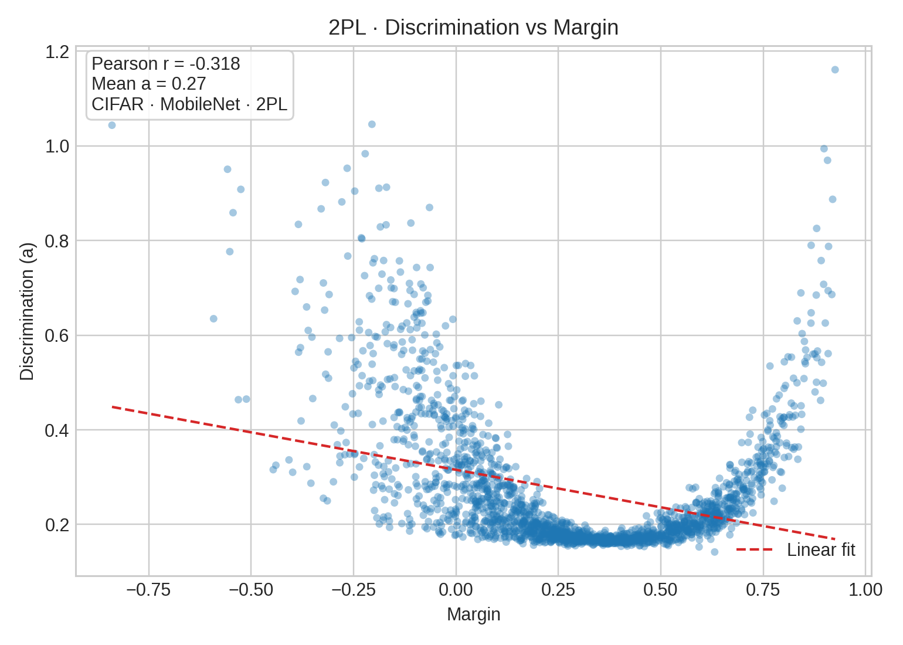
  

  

  

  

    
  

  

---

# 2PL Discrimination (MNIST)

- Mean 𝑎 lifts to **0.33 ± 0.25**, so only a modest slice of digits remains truly separating despite the high accuracy ceiling.
- 𝑎 correlates with margin at **+0.89** while its correlation with entropy flips to **−0.96**—uncertainty vanishes outside the awkward strokes.
- Discrimination climbs with margin and falls with entropy: crisp, easy digits carry the steepest slopes while ambiguous stroke collisions stay much flatter.

  

  

    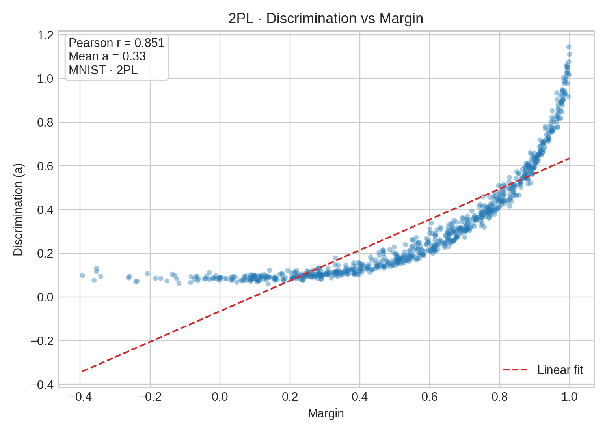
  

  

  

  

    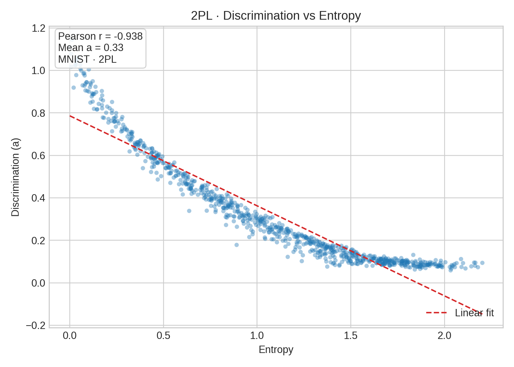
  

  

---

# 3PL Pilot · MobileNet

- 1k-epoch 3PL run (lr 0.01) lands at guess mean **0.35 ± 0.16**.
- θ vs accuracy stays tight (Pearson **0.98**); slopes average **0.32 ± 0.08** with a broader tail.
- High guess mass piles onto the ambiguous animal scenes (low margin, high entropy), reinforcing the “guessing” narrative.

  

    
    
3PL MobileNet · Guess distribution

  

  

    
    
3PL MobileNet · Guess vs Margin (colored by entropy)

  

---

# Tree Attribute Correlations · OOB Accuracy vs θ

- `scripts/analyze_tree_attribute_correlations.py` merges each tree’s depth/leaves/OOB stats with θ and discrimination aggregates.
- Pearson r (OOB accuracy, θ): PCA **+0.25**, MobileNet **+0.70**, MNIST **+0.39** — reliable trees earn higher ability across every study.
- CSV/JSON exports: `data/*/tree_attributes_with_signals.csv`, `data/*/tree_attribute_correlations*.json` for deeper dives.

  

    
PCA · OOB accuracy vs θ (r = +0.25)

    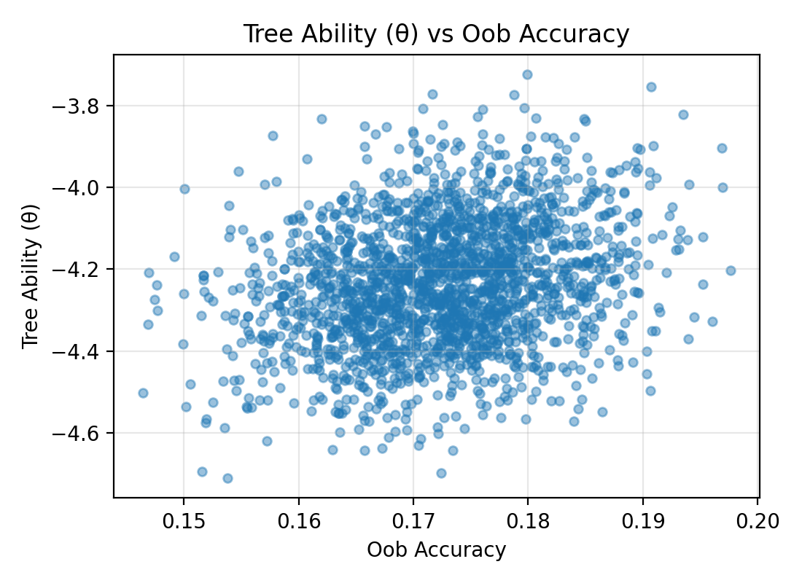
  

  

    
MobileNet · OOB acc vs θ (r = +0.70)

    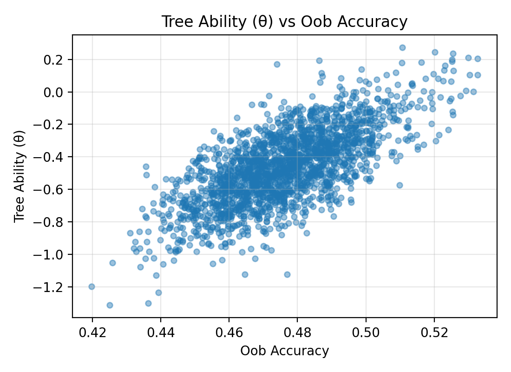
  

  

    
MNIST · OOB accuracy vs θ (r = +0.39)

    
  

---

# Tree Attribute Correlations · Leaf Count vs θ

- Pearson r (leaf count, θ): PCA **−0.27**, MobileNet **−0.73**, MNIST **−0.38** — pruning shallower trees boosts ability rankings.
- Leaf count penalizes overfitting branches; MobileNet shows the steepest drop because high-quality features reward compact trees.

  

    
PCA · Leaf count vs θ (r = −0.27)

    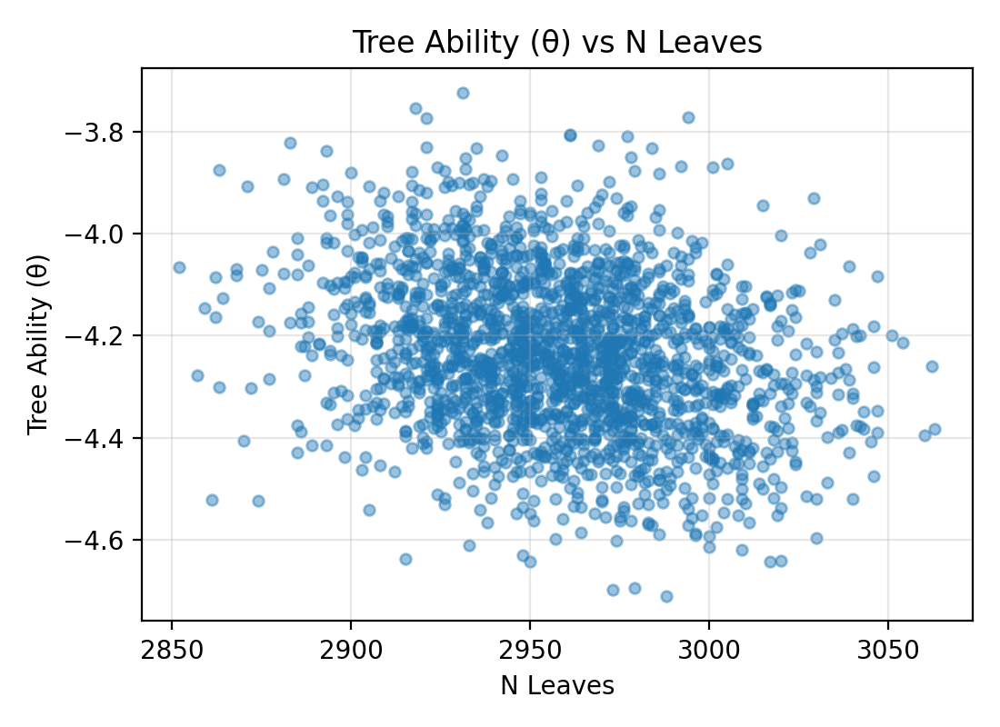
  

  

    
MobileNet · Leaf count vs θ (r = −0.73)

    
  

  

    
MNIST · Leaf count vs θ (r = −0.38)

    
  

---

# Key Takeaways

- IRT and RF still move in lockstep: θ tracks per-tree accuracy, while δ and 𝑎 surface stubborn item pockets.
- MobileNet’s discrimination tail isolates animal confusions despite stronger features; MNIST flips signs because mistakes are rare.
- 3PL adds a modest guessing floor (~0.25) without upsetting θ–accuracy alignment.
- Tree attributes expose pruning cues: shallow, high-OOB trees consistently land higher θ.

---

# Next Steps

- Run stability sweeps (50/100 trees, alternate seeds) to quantify variance in 𝑎 and θ.
- Decide whether 3PL merits extension to PCA/MNIST or documenting as MobileNet-only.
- Finish item-tier overlays (high/medium/low 𝑎) and align them with the qualitative grids.

---

# References

- Wilson, M. (2005). <em>Constructing Measures: An Item Response Modeling Approach</em>. Lawrence Erlbaum Associates.
- Breiman, L., Friedman, J. H., Olshen, R. A., &amp; Stone, C. J. (1984). <em>Classification and Regression Trees</em>. Wadsworth.
- Breiman, L. (2001). "Random Forests." <em>Machine Learning</em>, 45(1), 5–32.

---

# Extra Material

--- 

# Decision Trees — From Data to Splits

  

**Idea:** recursively split data to  increase *purity* of labels (Breiman et al., 1984).  

Example:  
> “PetalLength < 2.5?” → all *Setosa* left, others right.

At each node:
- compute **impurity** (e.g., *entropy* or *Gini*):
  $$ H = -\sum_i p_i \log_2 p_i $$
- choose the split that **maximally reduces impurity** — i.e. makes groups more uniform.  

A single tree = a set of *if–then* rules that classify or predict.
  

  

| PetalLength | PetalWidth | Species |
|--------------|-------------|----------|
| 1.4 | 0.2 | Setosa |
| 4.7 | 1.4 | Versicolor |
| 5.5 | 2.0 | Virginica |

 
 

---

# Gini vs. Entropy — Two Lenses on Node Impurity

**Entropy (Information Theory):**

$$ H = - \sum_i p_i \log_2 p_i $$

Measures **uncertainty** —  expected information (in bits) needed to classify a random sample.  *High when classes are evenly mixed.*

**Gini Impurity (Probability of Misclassification):**

$$ G = 1 - \sum_i p_i^2 $$

Measures **chance of error** —  probability that two randomly drawn samples from the node  belong to different classes.

| Metric | Theoretical Lens | Interpretation | Typical Use |
|---------|------------------|----------------|--------------|
| **Entropy** | Information theory | “How surprised would I be?” | ID3, C4.5 trees |
| **Gini** | Probability theory | “How often would I be wrong?” | CART trees, scikit-learn default |

> Both peak when classes are perfectly mixed (p = 0.5).  
> Gini is slightly flatter — faster to compute, less sensitive to extremes.

---

# Estimating θ and δ — A Toy Rasch Example Worked-Out

We’ll fit a **1-Parameter Logistic Model (Rasch Model)** to a tiny response matrix:

| Person | Item 1 | Item 2 | Item 3 | Total rᵢ |
|:------:|:------:|:------:|:------:|:---------:|
| **A** | 1 | 1 | 0 | 2 |
| **B** | 1 | 0 | 0 | 1 |
| **C** | 0 | 0 | 1 | 1 |

“1” = correct “0” = incorrect  
Three people, three items — small enough to solve by hand.

**The Rasch Model**:
For each person *i* and item *j*:

$$ P(X_{ij}=1|\theta_i,\delta_j)= \frac{1}{1+\exp[-(\theta_i-\delta_j)]} $$

- $(\theta_i)$: person’s latent **ability**  
- $(\delta_j)$: item’s **difficulty**  

When $(\theta_i = \delta_j)$, $(P(X_{ij}=1)=0.5)$ — equal odds of success and failure.

---

# Step 1 — Initial Estimates

A simple starting point uses **logits of proportions**:

$$
\theta_i^{(0)} = \log\!\frac{r_i/m}{1-r_i/m}, \qquad
\delta_j^{(0)} = -\log\!\frac{s_j/n}{1-s_j/n}
$$

where  
- $( m=3 )$ items per person  
- $( n=3 )$ people per item  
- $( r_i )$ : person totals $( s_j )$: item totals  

Compute:

|        | Formula | Value |
|:-------|:---------|:------|
| Resp_A | logit(2/3) |  +0.693 |
| Resp_B | logit(1/3) |  –0.693 |
| Resp_C | logit(1/3) |  –0.693 |

|        | Formula | Value |
|:-------|:---------|:------|
| Item 1 | –logit(2/3) |  –0.693 |
| Item 2 | –logit(1/3) |  +0.693 |
| Item 3 | –logit(1/3) |  +0.693 |

Center the item difficulties so ∑δ = 0.

---

# Step 2 — Compute Expected Scores

- Plug into the Rasch model:

$$
P_{ij} = \frac{1}{1+e^{-(\theta_i-\delta_j)}}
$$

- Sum across items → expected totals per person.

| Person | Expected rᵢ | Observed rᵢ |
|:------:|:-------------:|:-------------:|
| A | 1.95 | 2 |
| B | 1.04 | 1 |
| C | 1.04 | 1 |

- Pretty close already — the model almost reproduces the data.

---

# Step 3 — One Newton Update (By Hand)

- Adjust each parameter so model-predicted totals match observed totals:

$$
\theta_i \leftarrow \theta_i +
\frac{r_i-\sum_j P_{ij}}
     {\sum_j P_{ij}(1-P_{ij})}
$$

$$
\delta_j \leftarrow \delta_j -
\frac{s_j-\sum_i P_{ij}}
     {\sum_i P_{ij}(1-P_{ij})}
$$

- Re-center ∑δ = 0 after each step.

- After one iteration (rounded):

| Parameter | Value |
|------------|-------|
| θₐ |  +0.77 |
| θᵦ |  –0.75 |
| θ𝑐 |  –0.75 |
| δ₁ |  –1.04 |
| δ₂ |  +0.52 |
| δ₃ |  +0.52 |

---

# Step 4 — Check Fit

- Recompute expectations:

| Person | Expected rᵢ | Observed rᵢ |
|:------:|:-------------:|:-------------:|
| A | 1.99 | 2 |
| B | 1.01 | 1 |
| C | 1.01 | 1 |

- Perfect alignment — the model now fits.

---

# What We Learned

- \( r_i \) (person totals) are **sufficient** for estimating θ.  
- \( s_j \) (item totals) are **sufficient** for estimating δ.  
- Centering fixes the arbitrary origin of the latent scale.  
- Precision varies by level: extreme scores → higher uncertainty.

> In the Rasch world, **abilities and difficulties calibrate each other** —  
> each θ and δ defined only in relation to the ensemble.

---

# From Rasch Estimation to Stochastic Variational Inference (SVI)

Both Rasch estimation and SVI **fit latent-variable models**, but they differ in *how* they estimate hidden parameters.

| Aspect | Rasch (by hand) | Stochastic Variational Inference |
|:-------|:----------------|:--------------------------------|
| **Goal** | Find point estimates of θ and δ that best reproduce observed responses. | Approximate full posterior distributions over latent variables. |
| **Computation** | Deterministic updates (e.g., Newton–Raphson). | Stochastic gradient ascent on an *evidence lower bound* (ELBO). |
| **Uncertainty** | Single best estimate per parameter. | Explicitly models uncertainty via variational distributions \( q(\theta,\delta) \). |
| **Scale** | Works for small datasets, exact likelihood. | Scales to millions of observations using minibatches. |
| **Analogy** | Matching observed vs. expected totals until equilibrium. | Minimizing the KL divergence between approximate and true posteriors. |

> Rasch estimation is like hand-tuning a few dials until predicted counts match reality.  
> SVI automates that process with noisy gradients — learning not just *where the dials land*, but *how uncertain we are about their true positions.*

